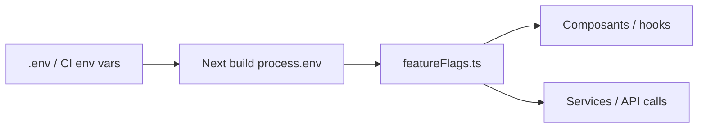
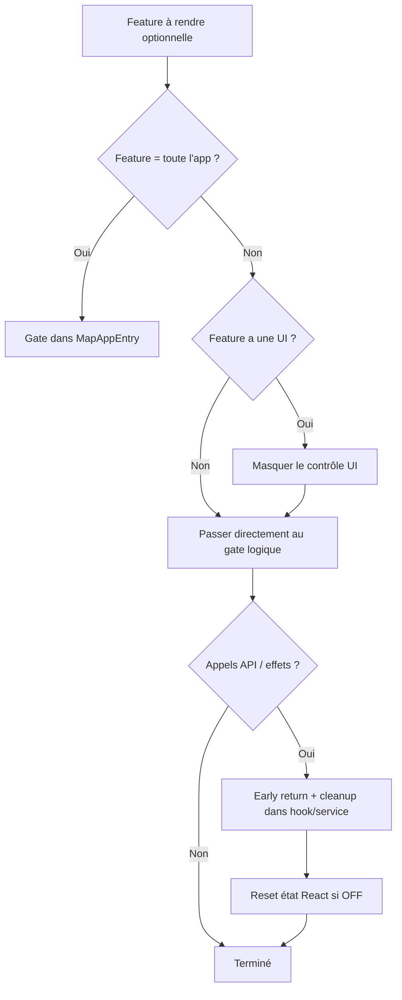

# Feature flags – OpenAirMap

Guide réutilisable pour rendre une fonctionnalité optionnelle via feature flag dans OpenAirMap.

## Architecture actuelle

OpenAirMap utilise un modèle **simple, statique, côté front** :

1. Variables d'environnement Next préfixées `NEXT_PUBLIC_*` (injectées au **build**, pas au runtime navigateur)
2. Centralisation dans `src/config/featureFlags.ts` via `parseBooleanEnv` + `src/lib/env.ts`
3. Gabarit documenté dans `.env.inc`
4. Consommation directe : `import { featureFlags } from '...'` puis condition UI / logique / early return
5. Flag serveur `NOINDEX` (sans `NEXT_PUBLIC_`) pour la preprod



### Fichiers clés

| Fichier | Rôle |
|---------|------|
| `.env` / `.env.inc` | Déclaration et documentation des variables |
| `src/config/featureFlags.ts` | Lecture et normalisation des flags |
| Composants / hooks | Consommation du flag (UI, logique, API) |

### Flags actuellement consommés

| Flag | Variable | Fichiers principaux |
|------|----------|---------------------|
| `maintenanceMode` | `NEXT_PUBLIC_MAINTENANCE_MODE` | `src/components/MapAppEntry.tsx` |
| `wildfireLayer` | `NEXT_PUBLIC_ENABLE_WILDFIRE_LAYER` | `src/components/map/hooks/useWildfireLayer.ts` |
| `solidLineNebuleAir` | `NEXT_PUBLIC_SOLID_LINE_NEBULEAIR` | `src/components/charts/HistoricalChart.tsx` |
| `markerNebuleAir` | `NEXT_PUBLIC_MARKER_NEBULEAIR` | `src/constants/markers.ts` |
| `tooltipMinZoom` | `NEXT_PUBLIC_TOOLTIP_MIN_ZOOM` | `src/components/map/MarkerWithTooltip.tsx` |
| `useAdvertising` | `NEXT_PUBLIC_USE_ADVERTISING` | `src/components/map/AirQualityMap.tsx` (+ `SensorPromoCard`) |
| — | `NEXT_PUBLIC_SENSOR_SHOP_URL` | `src/config/advertisingConfig.ts` (via `env`) |
| `historicalModeLogs` | `NEXT_PUBLIC_HISTORICAL_MODE_LOGS` | `src/hooks/useTemporalVisualization.ts` |
| `useMicrospotApi` | `NEXT_PUBLIC_USE_MICROSPOT_API` | `src/services/DataServiceFactory.ts` → `AtmoMicroV2Service` |
| (domaine forcé) | `NEXT_PUBLIC_FORCE_DOMAIN_CONFIG` | `src/lib/domain.ts` |
| (preprod) | `NOINDEX` | `app/robots.ts`, `generateMetadata` |

`useMicrospotApi` (défaut `false`) bascule AtmoMicro de l’ancienne API AtmoSud vers l’API microspot. Laisser à `false` tant que toutes les campagnes ne sont pas exposées côté microspot.

### Module séparé : analytics Matomo

Les variables Matomo sont lues dans `src/services/analyticsService.ts` via `env` (`src/lib/env.ts`) :

| Variable | Rôle |
|----------|------|
| `NEXT_PUBLIC_MATOMO_ENABLED` | Active le tracking |
| `NEXT_PUBLIC_MATOMO_DEBUG` | Logs debug console |
| `NEXT_PUBLIC_MATOMO_SEND` | Envoi réel des hits |
| `NEXT_PUBLIC_MATOMO_STRIP_QUERY_PARAMS` | Nettoie les query params des URLs trackées |
| `NEXT_PUBLIC_MATOMO_URL` | URL de l’instance Matomo |
| `NEXT_PUBLIC_MATOMO_SITE_ID` | Identifiant de site Matomo |

---

## Patterns de référence dans le repo

| Pattern | Exemple | Ce qu'il fait bien |
|---------|---------|-------------------|
| **Gate au point d'entrée** | `MapAppEntry.tsx` + `maintenanceMode` | Coupe toute l'app si désactivé |
| **Gate UI + état reset** | `useWildfireLayer.ts` | Pas d'appel API, état vidé, cleanup |
| **Gate comportement** | `MarkerWithTooltip.tsx` | Ajuste un comportement sans masquer toute la feature |
| **Gate rendu conditionnel** | `HistoricalChart.tsx` | Active un mode d'affichage alternatif |

### Anti-patterns observés (à éviter)

- Déclarer un flag dans `featureFlags.ts` **sans le consommer**
- Documenter une variable dans `.env.inc` **sans la lire** dans `src/lib/env.ts`
- Dupliquer `parseBooleanEnv` ailleurs sans raison (préférer `src/lib/env.ts`)

---

## Checklist générique

À appliquer pour toute nouvelle feature rendue optionnelle.

### 1. Cadrer la feature

- [ ] **Identifier le périmètre exact** : UI seule ? appels API ? état React ? les deux ?
- [ ] **Lister tous les points d'entrée** : header desktop, menu mobile, panneaux latéraux, hooks carte, services, graphiques, modales, analytics
- [ ] **Choisir la valeur par défaut** (`true` = activé par défaut, `false` = opt-in) selon le risque métier
- [ ] **Nommer la variable** : `NEXT_PUBLIC_ENABLE_<FEATURE>` ou `NEXT_PUBLIC_DISPLAY_<FEATURE>` (cohérent avec `.env.inc`)

### 2. Déclarer le flag

- [ ] Ajouter la variable dans `.env.inc` avec un commentaire clair (type, défaut, impact)
- [ ] Ajouter la propriété dans `src/config/featureFlags.ts` :

```ts
myFeature: parseBooleanEnv(env.myFeature, true),
```

- [ ] Si le flag n'est pas booléen (ex. nombre comme `tooltipMinZoom`), ajouter un parseur dédié dans le même fichier
- [ ] Valeurs acceptées (déjà standardisées) :
  - actif : `true`, `1`, `on`, `yes`, `enabled`
  - inactif : `false`, `0`, `off`, `no`, `disabled`

### 3. Choisir le niveau de gate (1 ou plusieurs)



| Niveau | Quand l'utiliser | Fichiers typiques |
|--------|------------------|-------------------|
| **Entrée app** | Feature = toute l'application | `MapAppEntry.tsx` |
| **UI** | Bouton, menu, section, toggle | `App.tsx`, `MobileMenuBurger.tsx`, contrôles |
| **État React** | Empêcher activation résiduelle | Handler `onXxxChange`, `useEffect` de reset |
| **Hook / service** | Bloquer appels réseau et side-effects | `hooks/`, `services/` |
| **Rendu dérivé** | Légendes, overlays, tooltips | Composants enfants (souvent auto-coupés si état = null) |

### 4. Implémenter le gate UI

- [ ] Conditionner le rendu : `{featureFlags.myFeature && <MyControl />}`
- [ ] Vérifier **toutes** les surfaces : desktop **et** mobile (souvent 2 endroits distincts, ex. `App.tsx` + `MobileMenuBurger.tsx`)
- [ ] Si la feature a un état sélectionné (`currentXxx`), forcer `null` quand le flag passe à `false`

### 5. Implémenter le gate logique (indispensable)

Le masquage UI seul ne suffit pas : un état ou un effet peut encore tourner.

- [ ] **Early return** au début des `useEffect` / fetch :

```ts
if (!featureFlags.myFeature) {
  // reset état local
  return;
}
```

- [ ] **Guard dans les handlers** :

```ts
const handleChange = (value) => {
  if (!featureFlags.myFeature) return;
  setValue(value);
};
```

- [ ] **Cleanup** : retirer couches carte, annuler timers, vider tableaux d'état (modèle `useWildfireLayer.ts`)

### 6. Propager si nécessaire

- [ ] Lecture directe de `featureFlags` dans le hook/composant concerné (pattern actuel, simple)
- [ ] Ou passage d'une prop `isMyFeatureEnabled` depuis le parent (utile si testabilité ou découplage)
- [ ] Ne pas propager inutilement : un import de `featureFlags` dans le hook concerné suffit souvent

### 7. Documenter

- [ ] Mettre à jour `.env.inc` (obligatoire)
- [ ] Ajouter une note dans `README.md` si la feature est visible utilisateur ou critique ops (ex. maintenance)
- [ ] Commenter le **défaut** dans `featureFlags.ts` (comme `markerNebuleAir`)

### 8. Valider

- [ ] **Dev** : modifier `.env`, redémarrer `npm run dev` (Next n'injecte pas toujours les env à chaud)
- [ ] **Prod** : rebuild + redeploy (`NEXT_PUBLIC_*` est figé au build)
- [ ] Tester les 2 cas :
  - flag `true` → comportement inchangé
  - flag `false` → UI absente, état reset, aucun appel réseau, aucun artefact visuel
- [ ] Tester les chemins indirects : changement de pas de temps, ouverture panneau, refresh page avec flag OFF

### 9. (Optionnel) Tests

Le repo n'a pas encore de tests sur `featureFlags`. Si la feature est critique :

- [ ] Test unitaire du parseur (booléen, valeurs invalides, défaut)
- [ ] Test du hook/composant avec `vi.stubEnv` ou injection de prop

---

## Grille de décision rapide

| Type de feature | Flag recommandé | Où gate en priorité |
|-----------------|-----------------|---------------------|
| Page / module entier | `NEXT_PUBLIC_ENABLE_*` | `MapAppEntry.tsx` ou route parent |
| Couche carte | `NEXT_PUBLIC_ENABLE_*_LAYER` | hook carte + masquer contrôle |
| Contrôle UI seul | `NEXT_PUBLIC_DISPLAY_*` | composants de contrôle uniquement |
| Comportement d'affichage | `NEXT_PUBLIC_*` descriptif | util/composant ciblé |
| Analytics / tracking | module dédié ou `featureFlags` | service + init |

---

## Exemple appliqué : couche de modélisation (carte)

Pour illustrer la checklist sur une feature concrète du projet :

1. `NEXT_PUBLIC_ENABLE_MODELING_LAYER` dans `.env.inc` + `featureFlags.modelingLayer`
2. Masquer `ModelingLayerControl` dans `App.tsx` et `MobileMenuBurger.tsx`
3. Reset `currentModelingLayer` à `null` si flag OFF
4. Early return dans `useMapLayers.ts` (bloque WMTS + vent)
5. La légende disparaît automatiquement si plus de `currentModelingLegendUrl` : elle est agrégée dans `overlayLegendItems` / `OverlayLegendsCard` via `MapOverlays.tsx` (coexiste avec les légendes EFFIS)

**Note** : les courbes de modélisation dans les side panels (`showModeling` + `ModelingService`) sont une **feature séparée** → flag distinct si besoin (`NEXT_PUBLIC_ENABLE_MODELING_CHARTS`).

### Overlays feux (hors featureFlags)

| Overlay | Activation | Remarque |
|---------|------------|----------|
| feuxdeforet.fr | `NEXT_PUBLIC_ENABLE_WILDFIRE_LAYER` → `featureFlags.wildfireLayer` | Voir tableau des flags ci-dessus |
| EFFIS (points + zones brûlées) | Toujours proposé | Aucune variable d’env |

Détail technique : [`docs/features/DOCUMENTATION_COUCHES_FEUX.md`](features/DOCUMENTATION_COUCHES_FEUX.md).

---

## Règles d'or du projet

1. **Toujours centraliser** dans `featureFlags.ts` + `src/lib/env.ts`
2. **Toujours gate à 2 niveaux** : UI + logique/API
3. **Toujours documenter** dans `.env.inc`
4. **Ne jamais laisser un flag orphelin** (déclaré mais non consommé)
5. **Rappeler** : changement de flag = rebuild en prod
