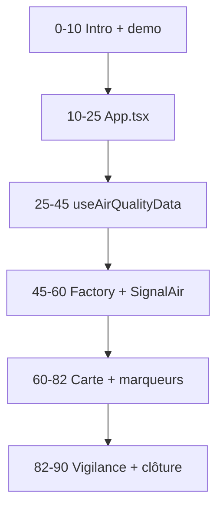

# OpenAirMap — Support animateur onboarding oral (90 min)

> **Usage :** ce document est un **script de passation** pour vous, l'animateur.
> Il n'est pas destine a etre lu tel quel par le nouveau dev.
> Profil cible : dev React/TS **intermediaire**, session **live 90 min**, walkthrough code sans modification.

---

## Mode d'emploi animateur

### Objectif de la session

A la fin des 90 minutes, le nouveau dev doit pouvoir :

- expliquer le flux `filtre UI -> App -> useAirQualityData -> service -> marqueur carte` ;
- ouvrir le bon fichier selon le type de bug ou d'evolution ;
- connaitre les 3 zones rouges du code et comment les modifier sans regression.

### Fil rouge a repeter 3 fois dans la session

```
filtre UI -> App state -> useAirQualityData -> DataServiceFactory -> service
-> devices/reports -> AirQualityMap -> MapDataMarkers -> icone marqueur
```

### Materiel a preparer avant la session

| Element | Detail |
|---|---|
| App locale | `npm run dev` sur http://localhost:3000 |
| IDE | Projet ouvert sur la racine OpenAirMap |
| Navigateur | Onglet Network visible (split ecran si possible) |
| Onglets IDE permanents | `MapAppEntry.tsx`, `App.tsx`, `useAirQualityData.ts`, `DataServiceFactory.ts`, `AirQualityMap.tsx`, `MapDataMarkers.tsx` |
| Docs de reference | [`DOCUMENTATION_USE_AIR_QUALITY_DATA.md`](./features/DOCUMENTATION_USE_AIR_QUALITY_DATA.md), [`audit-qualite-progressif.md`](./audit-qualite-progressif.md) |

### Regles d'animation

- **Ne pas lire le markdown mot a mot** : utilisez les blocs "A dire" comme trames.
- **Alterner app et code** : chaque bloc technique = 1 action UI + 1 fichier.
- **Valider avant d'avancer** : poser la question du checkpoint ; si reponse incomplete, reboucler 2 min sur le meme fichier.
- **Hors scope jour 1** : mode historique (mention rapide), i18n, CI/CD, couches feux — renvoyer vers docs.

---

## Agenda 90 min

| Plage | Bloc | Objectif | Signal "OK pour continuer" |
|---|---|---|---|
| 0:00–0:10 | Intro + demo app | Contexte metier AtmoSud, vue d'ensemble | Le dev sait nommer 3 sources de donnees |
| 0:10–0:25 | Entree + etat App | Comprendre qui porte l'etat global | Il identifie `selectedPollutant/Sources/TimeStep` |
| 0:25–0:45 | `useAirQualityData` | Comprendre l'orchestration des fetchs | Il explique pourquoi SignalAir est special |
| 0:45–1:00 | Factory + SignalAir | Comprendre le pattern service | Il decrit les 3 etapes pour ajouter une source |
| 1:00–1:22 | Carte + marqueurs | Relier donnees et rendu Leaflet | Il trace le chemin couleur marqueur -> constantes |
| 1:22–1:30 | Vigilance + clôture | Connaitre les zones rouges | Il coche la checklist d'autonomie (§8) |



---

## Script de session

Chaque bloc suit le format : **A dire** / **A montrer** / **A faire en live** / **Checkpoint**.

---

### Bloc 0 — Intro + demo app (0:00–0:10)

#### A dire

> « OpenAirMap est une SPA React/TypeScript pour AtmoSud : on affiche la qualite de l'air sur une carte Leaflet en agregeant plusieurs sources — stations de reference, microcapteurs, capteurs communautaires, signalements citoyens.
> Il n'y a pas de router : tout vit dans un seul ecran. Pas de Redux non plus : l'etat est local dans React.
> Aujourd'hui on se concentre sur le coeur : comment un changement de filtre declenche un appel API et finit en marqueur colore sur la carte. »

#### A montrer

- App sur http://localhost:3000
- Changer polluant, source, pas de temps dans le header
- Schema mental (fil rouge ci-dessus)

#### A faire en live

1. Cocher/décocher **AtmoRef** → observer marqueurs qui apparaissent/disparaissent.
2. Changer **PM2.5 → O3** → observer nouvelles requetes Network.
3. Ouvrir [`docs/ONBOARDING.md`](./ONBOARDING.md) §8 checklist — annoncer qu'on y reviendra en fin de session.

#### Checkpoint

| Question | Reponse attendue |
|---|---|
| « C'est quoi le role de l'app en une phrase ? » | Visualiser qualite de l'air sur carte en croisant plusieurs sources |
| « Ou est l'etat global de l'app ? » | Dans `App.tsx`, pas de store externe |
| « Cite 3 sources de donnees » | Ex : AtmoRef, AtmoMicro, NebuleAir (ou SignalAir, PurpleAir…) |

**Transition :** « Maintenant on remonte a l'entree de l'app et on ouvre `App.tsx`. »

---

### Bloc 1 — Entree + etat global (0:10–0:25)

#### A dire

> « Le point d'entrée client de la carte est `MapAppEntry.tsx`. Il décide si on monte l'app ou la page maintenance (après le routage Next dans `app/[locale]/…`).
> Ensuite tout passe par `App.tsx` : c'est le tableau de bord. Les menus ne fetch pas eux-mêmes — ils mettent à jour un état local, et c'est le hook `useAirQualityData` qui réagit et lance les appels API. »

#### A montrer

**1. Bootstrap — [`src/components/MapAppEntry.tsx`](../src/components/MapAppEntry.tsx)**

```tsx
export default function MapAppEntry() {
  if (featureFlags.maintenanceMode) {
    return <MaintenancePage />;
  }
  return <MapApp />; // dynamic import de App.tsx, ssr: false
}
```

**2. Etat filtres — [`src/App.tsx`](../src/App.tsx) ~L100**

```typescript
const [selectedPollutant, setSelectedPollutant] = useState(getDefaultPollutant());
const [selectedSources, setSelectedSources] = useState(getDefaultSources());
const [selectedTimeStep, setSelectedTimeStep] = useState(defaultTimeStep);
```

**3. Handlers — [`src/App.tsx`](../src/App.tsx) ~L154**

```typescript
const handlePollutantChange = useCallback((pollutant: string) => {
  setSelectedPollutant(pollutant);
}, []);
const handleSourceChange = useCallback((sources: string[]) => {
  setSelectedSources(sources);
}, []);
```

**4. Appel hook — [`src/App.tsx`](../src/App.tsx) ~L373**

```typescript
const { devices: normalDevices, reports, loading, error, loadingSources } =
  useAirQualityData({
    selectedPollutant,
    selectedSources,
    selectedTimeStep,
    signalAirPeriod,
    signalAirOptions,
    autoRefreshEnabled: autoRefreshEnabled && !isHistoricalModeActive,
  });
```

**5. Passage a la carte — [`src/App.tsx`](../src/App.tsx) ~L731**

```tsx
<AirQualityMap
  devices={devices}
  reports={reportsForMap}
  selectedPollutant={selectedPollutant}
  selectedSources={selectedSources}
  selectedTimeStep={selectedTimeStep}
  loading={loading}
/>
```

#### A faire en live

1. `Ctrl+P` → `MapAppEntry.tsx` puis `App.tsx`.
2. Rechercher symbole `handlePollutantChange` → montrer le lien avec `PollutantDropdown`.
3. Rechercher `useAirQualityData` → montrer quels etats sont passes en props.
4. **Mention rapide (2 min)** : `useTemporalVisualization` + `getCurrentDevices()` = flux parallele mode historique, pas le coeur temps reel.

#### Checkpoint

| Question | Reponse attendue |
|---|---|
| « Si je change le polluant, quel fichier declenche le refetch ? » | `useAirQualityData` via changement de props depuis `App.tsx` |
| « Les dropdowns appellent-ils directement les APIs ? » | Non, ils mettent a jour l'etat ; le hook fetch |
| « Ou voit-on la bascule maintenance ? » | `MapAppEntry.tsx` + `featureFlags.maintenanceMode` |

**Transition :** « L'etat est clair. Entrons dans le coeur metier : `useAirQualityData`. »

---

### Bloc 2 — Hook `useAirQualityData` (0:25–0:45)

#### A dire

> « C'est le fichier le plus important pour comprendre les donnees. Il orchestre tous les fetchs, gere le loading par source, l'auto-refresh, et surtout les regles speciales pour SignalAir et MobileAir qui ne se comportent pas comme AtmoRef ou NebuleAir.
> Chaque service retourne soit des `MeasurementDevice` (mesures quantitatives), soit des `SignalAirReport` (signalements qualitatifs). Le hook les separe. »

#### A montrer

**1. Contrat entree/sortie — [`src/hooks/useAirQualityData.ts`](../src/hooks/useAirQualityData.ts) ~L7–68**

**2. Garde-types — ~L40–50**

```typescript
const isMeasurementDevice = (item): item is MeasurementDevice =>
  "pollutant" in item && "value" in item && "unit" in item;
const isSignalAirReport = (item): item is SignalAirReport =>
  "signalType" in item;
```

**3. Exclusion auto-fetch + mapping — ~L84–96**

```typescript
const filteredSources = selectedSources.filter(
  (source) => source !== "signalair" && source !== "communautaire.mobileair"
);
const mappedSources = filteredSources.map((source) => {
  if (source.startsWith("communautaire.")) {
    return source.split(".")[1]; // "communautaire.nebuleair" -> "nebuleair"
  }
  return source;
});
```

**4. SignalAir declenche manuellement — ~L99–104**

```typescript
const shouldFetchSignalAir =
  isSignalAirSourceSelected &&
  !!signalAirOptions &&
  signalAirOptions.loadTrigger > signalAirLastTriggerRef.current;
```

**5. Boucle de fetch progressive — ~L212–268**

```typescript
const services = DataServiceFactory.getServices(mappedSources);
for (const index of fetchableIndexes) {
  const service = services[index];
  const data = await service.fetchData({
    pollutant: selectedPollutant,
    timeStep: selectedTimeStep,
    sources: mappedSources,
    signalAirPeriod,
    signalAirSelectedTypes: signalAirOptions?.selectedTypes,
    // ...
  });
  // Separation devices vs reports, mise a jour progressive
}
```

**6. Types communs — [`src/types/index.ts`](../src/types/index.ts)**

```typescript
export interface MeasurementDevice {
  id: string; latitude: number; longitude: number;
  source: string; pollutant: string; value: number; unit: string;
  qualityLevel?: string;
}
export interface SignalAirReport {
  id: string; latitude: number; longitude: number;
  source: string; signalType: string;
}
```

#### A faire en live

1. Decocher **NebuleAir** dans l'UI → observer Network + `loadingSources`.
2. Reactiver SignalAir → montrer qu'il faut cliquer **Charger** (pas de fetch auto).
3. Rechercher `loadTrigger` dans `App.tsx` (~L211) → montrer `handleSignalAirLoadRequest` qui incremente le trigger.

#### Checkpoint

| Question | Reponse attendue |
|---|---|
| « Que devient `communautaire.nebuleair` avant la factory ? » | `nebuleair` |
| « Pourquoi SignalAir n'est pas fetch comme AtmoRef ? » | Exclu du auto-fetch ; declenche par `loadTrigger` |
| « Difference `MeasurementDevice` vs `SignalAirReport` ? » | Mesure quantitative (value/unit) vs signalement qualitatif (signalType) |
| « Que se passe-t-il si une source plante ? » | Les autres continuent ; chargement progressif |

**Transition :** « Le hook delegue aux services via la factory. Ouvrons `DataServiceFactory` puis un service concret. »

---

### Bloc 3 — Factory + service SignalAir (0:45–1:00)

#### A dire

> « Chaque source a sa propre classe service. La factory est un registre : on lui donne un code source, elle retourne un singleton.
> Pour ajouter une source, il faut 3 choses : entree dans `sources.ts`, nouvelle classe service, entree dans la factory.
> SignalAir est un bon exemple : API GeoJSON heterogene, transformation vers un type commun. AtmoRef est le meme pattern mais beaucoup plus gros — a lire seul. »

#### A montrer

**1. Factory — [`src/services/DataServiceFactory.ts`](../src/services/DataServiceFactory.ts)**

```typescript
private static readonly serviceConstructors = {
  atmoRef: AtmoRefService,
  atmoMicro: AtmoMicroService,
  nebuleair: NebuleAirService,
  signalair: SignalAirService,
  mobileair: MobileAirService,
  purpleair: PurpleAirService,
  sensorCommunity: SensorCommunityService,
};
static getService(sourceCode: string): DataService { /* singleton */ }
```

**2. Contrat base — [`src/services/BaseDataService.ts`](../src/services/BaseDataService.ts)**

```typescript
export abstract class BaseDataService implements DataService {
  abstract fetchData(params: DataFetchParams): Promise<
    MeasurementDevice[] | SignalAirReport[]
  >;
  protected createDevice(...): MeasurementDevice { /* normalisation */ }
  protected async makeRequest(url: string): Promise<any> { /* fetch CORS */ }
}
```

**3. Service concret — [`src/services/SignalAirService.ts`](../src/services/SignalAirService.ts)**

```typescript
async fetchData(params: DataFetchParams): Promise<SignalAirReport[]> {
  const period = params.signalAirPeriod || this.getDefaultPeriod();
  // Appels GeoJSON multi-types (odeur, bruit, visuel, brulage)
  // Transformation features -> SignalAirReport[]
}
```

**4. Tableau sources (a reciter oralement)**

| Code UI | Service | Retour |
|---|---|---|
| `atmoRef` | `AtmoRefService` | `MeasurementDevice[]` |
| `atmoMicro` | `AtmoMicroService` | `MeasurementDevice[]` |
| `communautaire.nebuleair` | `NebuleAirService` | `MeasurementDevice[]` |
| `signalair` | `SignalAirService` | `SignalAirReport[]` |
| `communautaire.mobileair` | `MobileAirService` | `MeasurementDevice[]` (routes) |

**5. Test de reference — [`src/services/__tests__/SignalAirService.test.ts`](../src/services/__tests__/SignalAirService.test.ts)** (montrer qu'il existe, survoler 1 cas)

#### A faire en live

1. `Ctrl+P` → `DataServiceFactory` → `SignalAirService`.
2. Montrer [`src/constants/sources.ts`](../src/constants/sources.ts) `getDefaultSources()` — lien UI ↔ codes.
3. Contraste rapide : ouvrir `AtmoRefService.ts` (709 lignes) — « meme pattern, plus dense ».

#### Checkpoint

| Question | Reponse attendue |
|---|---|
| « Quelles 3 etapes pour ajouter une nouvelle source ? » | Constante `sources.ts` + classe service + entree factory |
| « Ou normaliser une reponse API bizarre ? » | Dans le service, pas dans le composant carte |
| « Ou activer NebuleAir par defaut ? » | `sources.ts`, champ `activated` sur la sous-source |

**Transition :** « Les donnees arrivent en `devices`/`reports`. Voyons comment elles deviennent des marqueurs. »

---

### Bloc 4 — Carte + marqueurs (1:00–1:22)

#### A dire

> « `AirQualityMap` est l'orchestrateur carte : Leaflet, hooks dedies, panneaux lateraux, overlays. C'est un gros fichier — zone rouge — mais on ne lit que le chemin de rendu aujourd'hui.
> `MapDataMarkers` dispatch le rendu : marqueurs classiques, spiderfy, routes MobileAir, signalements SignalAir.
> La couleur d'un marqueur ne vient pas du JSX : seuils dans les constantes → calcul du niveau → icone dans `mapIconUtils`. »

#### A montrer

**1. Tri + props — [`src/components/map/AirQualityMap.tsx`](../src/components/map/AirQualityMap.tsx)**

```typescript
// ~L339 : tri priorite sources (atmoRef > atmoMicro > nebuleair)
const sortedDevices = useMemo(() => sortDevicesByPriority(devices), [devices]);

// ~L632 : clic marqueur -> ouverture side panel
const handleMarkerClick = useCallback((device) => { /* useSidePanels */ }, []);

// ~L961 : rendu
<MapDataMarkers
  sortedDevices={sortedDevices}
  reports={reports}
  createCustomIconWrapper={createCustomIconWrapper}
  handleMarkerClick={handleMarkerClick}
/>
```

**2. Dispatch rendu — [`src/components/map/MapDataMarkers.tsx`](../src/components/map/MapDataMarkers.tsx)**

```tsx
{spiderfyConfig.enabled ? (
  <CustomSpiderfiedMarkers devices={devicesWithoutMobileAir} ... />
) : (
  devicesWithoutMobileAir.map((device) => (
    <MarkerWithTooltip
      position={[device.latitude, device.longitude]}
      icon={createCustomIconWrapper(device)}
      eventHandlers={{ click: () => handleMarkerClick(device) }}
    />
  ))
)}
{isSignalAirVisible && <CustomSpiderfiedSignalAirMarkers reports={reports} ... />}
{isMobileAirVisible && <MobileAirRoutes routes={...} />}
```

**3. Couleur marqueur — [`src/components/map/utils/mapIconUtils.ts`](../src/components/map/utils/mapIconUtils.ts)**

```typescript
export const createCustomIcon = (device: MeasurementDevice): L.DivIcon => {
  const qualityLevel = hasValidValue && device.qualityLevel
    ? device.qualityLevel : "default";
  const markerPath = getMarkerPath(device.source, qualityLevel);
  // DivIcon Leaflet avec image + valeur
};
```

**4. Seuils — [`src/constants/pollutants.ts`](../src/constants/pollutants.ts) + [`src/utils/index.ts`](../src/utils/index.ts)**

```typescript
export function getAirQualityLevel(value: number, thresholds: Seuils): string {
  if (value <= thresholds.bon.max) return "bon";
  if (value <= thresholds.moyen.max) return "moyen";
  // ... degrade, mauvais, tresMauvais, extrMauvais
}
```

**5. Panneaux — [`src/components/map/MapPanelsContainer.tsx`](../src/components/map/MapPanelsContainer.tsx)** (survoler les imports : `StationSidePanel`, `MicroSidePanel`, `SignalAirDetailPanel`…)

#### A faire en live

1. Cliquer un marqueur AtmoRef → montrer le side panel qui s'ouvre.
2. Exercice remontee : marqueur visible → `MapDataMarkers` → `AirQualityMap` → `App` → `useAirQualityData` → `AtmoRefService` (5 sauts max).
3. **Mention (1 min)** : couches feux/modélisation/vent = flux parallele via `useMapLayers`, pas via `useAirQualityData`.

#### Checkpoint

| Question | Reponse attendue |
|---|---|
| « D'ou vient la couleur d'un marqueur PM2.5 ? » | Seuils `pollutants.ts` → `qualityLevel` → `mapIconUtils` |
| « Quel composant rend les marqueurs ? » | `MapDataMarkers` (appele par `AirQualityMap`) |
| « Clic station AtmoRef : quel panel ? » | `StationSidePanel` via `MapPanelsContainer` |
| « Pourquoi certains marqueurs passent devant ? » | `sortDevicesByPriority` / z-index (`mapIconUtils`) |

**Transition :** « On a le flux complet. Finissons par les zones sensibles et ta checklist d'autonomie. »

---

### Bloc 5 — Vigilance + clôture (1:22–1:30)

#### A dire

> « Le projet a une base saine et modulaire. La difficulte principale n'est pas le manque de structure, c'est la taille de certains fichiers centraux.
> Regle d'or : petits changements, verification manuelle, lire le flux complet avant d'editer.
> La couverture de tests est partielle — ne suppose pas qu'un test attrapera ta regression. »

#### Messages de vigilance (a dire oralement)

| Zone | Message oral | Safe path |
|---|---|---|
| `AirQualityMap.tsx` (~1076L) | « Ne mets jamais de logique metier inline ici. Extrais vers un hook ou sous-composant. » | Props visuelles, z-index, libelles |
| `App.tsx` (~865L) | « Chaque useState a des effets en cascade. Limite le scope de ta PR. » | Handler isole + extraction hook |
| `useAirQualityData.ts` | « SignalAir/MobileAir ont des regles a part. Ne les remets pas dans le flux standard sans relire. » | Extraire regle en fonction pure + test |
| `useTemporalVisualization.ts` | « Mode historique desactive l'auto-refresh. Tester le basculement temps reel ↔ historique. » | Backlog : extraire merge temporel |
| `AtmoMicroService` / `NebuleAirService` | « Services longs avec cache et fallback mock. Lire les tests avant de modifier. » | Transformation pure des payloads |
| `types/index.ts` (~682L) | « Contrat transverse. Ajouter des champs optionnels, ne pas reorganiser en bloc. » | Split progressif en tache dediee |

#### Dette deja traitee (rassurer)

- Garde-types dans `useAirQualityData`
- Registre declaratif factory
- IDs SignalAir deterministes
- Fix routes MobileAir multi-capteurs

Detail : [`docs/audit-qualite-progressif.md`](./audit-qualite-progressif.md)

#### Etat tests (a mentionner)

- Strategie cible non totalement atteinte : [`docs/strategie-tests.md`](./strategie-tests.md)
- 8 services testes unitairement ; 1 scenario sur `useAirQualityData` ; 0 test composant UI
- E2E Playwright present mais certains scenarios skip si API vide

#### A faire en live (clôture)

1. Parcourir l'arbre de decision §7 a voix haute avec un cas fictif.
2. Cocher la checklist §8 avec le nouveau dev.
3. Donner les docs « jour 2+ » : mode historique, i18n, feature flags, CI/CD.

---

## Variante 60 min (si pressé)

| Sacrifier | Garder absolument |
|---|---|
| Detail `SignalAirService` (survoler factory seulement) | Bloc 2 `useAirQualityData` (20 min) |
| `MapPanelsContainer` et side panels | Bloc 1 `App.tsx` (12 min) |
| Constantes polluants en detail | Bloc 4 carte + marqueurs (15 min) |
| Demo Network approfondie | Bloc 5 vigilance (5 min) |

Parcours raccourci : Intro (5) → App (12) → Hook (20) → Factory (8) → Carte (15) → Clôture (5).

---

## Checklist d'autonomie (fin de session)

Cocher avec le nouveau dev :

- [ ] Le projet tourne localement (`npm run dev`)
- [ ] Il sait ou est l'etat principal (`App.tsx`, `selectedPollutant/Sources/TimeStep`)
- [ ] Il explique le role de `useAirQualityData`
- [ ] Il sait pourquoi SignalAir/MobileAir sont speciaux
- [ ] Il trace une source via `DataServiceFactory` jusqu'au service
- [ ] Il comprend `MeasurementDevice` vs `SignalAirReport`
- [ ] Il sait ou sont rendus les marqueurs (`MapDataMarkers` + `mapIconUtils`)
- [ ] Il connait les 3 zones rouges (`App`, `AirQualityMap`, gros services)
- [ ] Il sait ou chercher selon le type de bug (§7)
- [ ] Il a les references pour approfondir (§9)

### Exercice final (5 min, sans coder)

> « A voix haute : je decoche NebuleAir → … → le marqueur disparait. Nomme chaque etape et chaque fichier traverse. »

Reponse attendue : `SourceDropdown` → `handleSourceChange` → `App state` → `useAirQualityData` (filtre sources) → `DataServiceFactory` (pas de call NebuleAir) → `devices` mis a jour → `AirQualityMap` → `MapDataMarkers` → marqueur absent.

---

## Arbre de decision : ou modifier quoi ?

| Besoin | Fichier(s) |
|---|---|
| Libelle / texte UI | `components/controls/` ou `locales/` (i18n) |
| Source active par defaut | `constants/sources.ts` |
| Seuil / couleur marqueur | `constants/pollutants.ts` + `utils/index.ts` |
| Compatibilite source/polluant/pas de temps | `constants/` + `utils/sourceCompatibility.ts` |
| Bug fetch / mapping d'une source | `services/<Source>Service.ts` |
| Orchestration chargements | `hooks/useAirQualityData.ts` |
| Bug affichage carte / marqueur | `components/map/` (`AirQualityMap`, `MapDataMarkers`, `mapIconUtils`) |
| Bug panel lateral | `components/panels/` + `MapPanelsContainer.tsx` |
| Nouvelle source de donnees | `sources.ts` + nouveau service + `DataServiceFactory.ts` |
| Couche carte (feux, vent, modelisation) | `useMapLayers` + services couches (hors hook data) |

---

## Erreurs frequentes en onboarding

| Erreur | Pourquoi c'est un piege | Correction |
|---|---|---|
| Remettre SignalAir dans le auto-fetch | Casse le flux « Charger » explicite | Relire filtres ~L84 et `loadTrigger` |
| Confondre code UI et code service | `communautaire.nebuleair` ≠ `nebuleair` en interne | Toujours passer par le mapping du hook |
| Ajouter logique metier dans `AirQualityMap` | Fichier deja surcharge, regressions faciles | Extraire hook/composant |
| Modifier seuils sans tester la carte | Impacte couleurs + dropdowns + APIs | Verifier fallback polluant dans App |
| Supposer tests exhaustifs | Couverture partielle, E2E skip possibles | Verification manuelle Network + UI |
| Debugger NebuleAir en local sans verifier le mock | Fallback mock en dev | Verifier branche mock dans `NebuleAirService` |

---

## Ressources post-session (jour 2+)

| Doc | Quand la consulter |
|---|---|
| [`README.md`](../README.md) | Setup, commandes, maintenance |
| [`DOCUMENTATION_USE_AIR_QUALITY_DATA.md`](./features/DOCUMENTATION_USE_AIR_QUALITY_DATA.md) | Approfondir le hook |
| [`DOCUMENTATION_MODE_HISTORIQUE.md`](./features/DOCUMENTATION_MODE_HISTORIQUE.md) | Mode historique + playback |
| [`FEATURE_FLAGS.md`](./FEATURE_FLAGS.md) | Activer/desactiver features |
| [`INTERNATIONALISATION_I18N.md`](./INTERNATIONALISATION_I18N.md) | Traductions |
| [`DOCUMENTATION_COUCHES_FEUX.md`](./features/DOCUMENTATION_COUCHES_FEUX.md) | Couches feux EFFIS/feuxdeforet.fr |
| [`strategie-tests.md`](./strategie-tests.md) | Strategie qualite |
| [`audit-qualite-progressif.md`](./audit-qualite-progressif.md) | Dette technique detaillee |
| [`.cursorrules`](../.cursorrules) | Conventions projet |

---

## Fichiers a garder ouverts pendant la session

1. [`src/components/MapAppEntry.tsx`](../src/components/MapAppEntry.tsx)
2. [`src/App.tsx`](../src/App.tsx)
3. [`src/hooks/useAirQualityData.ts`](../src/hooks/useAirQualityData.ts)
4. [`src/services/DataServiceFactory.ts`](../src/services/DataServiceFactory.ts)
5. [`src/services/SignalAirService.ts`](../src/services/SignalAirService.ts)
6. [`src/components/map/AirQualityMap.tsx`](../src/components/map/AirQualityMap.tsx)
7. [`src/components/map/MapDataMarkers.tsx`](../src/components/map/MapDataMarkers.tsx)
8. [`src/components/map/utils/mapIconUtils.ts`](../src/components/map/utils/mapIconUtils.ts)
