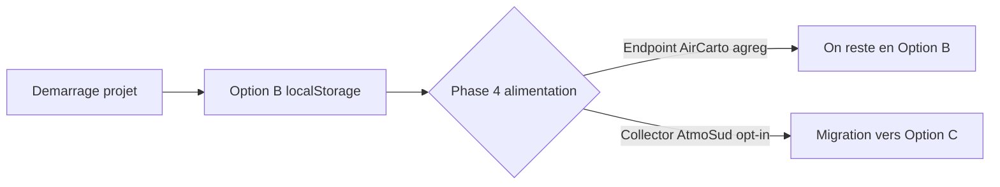
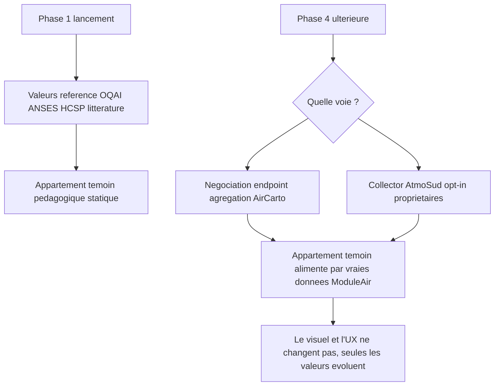
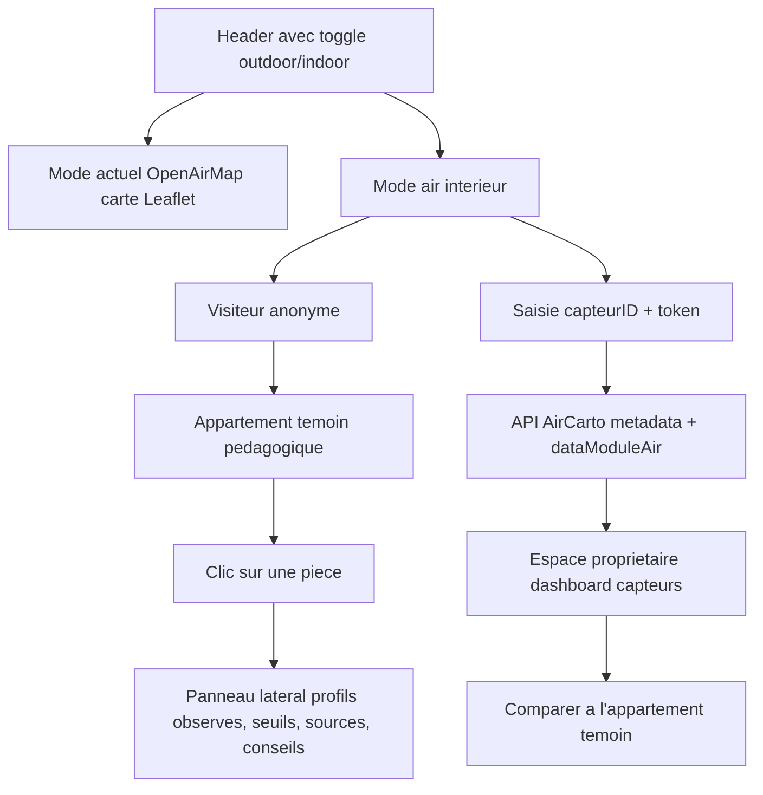
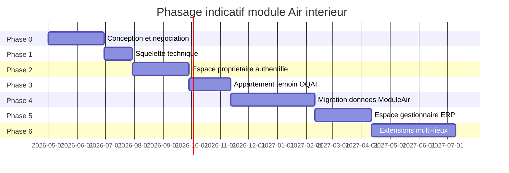

# Conception du module "Air intérieur" — OpenAirMap

## État du document

Ce document est un **document de conception** (non un plan d'exécution figé). Il sert de base de discussion entre AtmoSud, AirCarto et le DPO avant toute implémentation. **Aucun code applicatif n'est livré à ce stade.**

Il décrit l'extension d'OpenAirMap avec un mode "Air intérieur" basé sur les capteurs **ModuleAir** d'AirCarto. Le concept central est un **appartement témoin** interactif (et non une carte géographique), accompagné de deux espaces authentifiés : propriétaires de capteurs et gestionnaires d'établissements (ERP).

## Résumé exécutif (10 lignes)

- Le projet indoor repose sur une métaphore **appartement témoin**.
- Le MVP cible d'abord un usage concret : **espace propriétaire ModuleAir** + **écran public pédagogique**.
- Les données PoC publiques s'appuient sur **OQEI/OQAI (CNL2/CNL1)**, pas sur des capteurs particuliers.
- La logique scientifique suit 3 couches : **normes santé** / **profils d'exposition** / **mesures réelles**.
- Le document distingue désormais ce qui est **figé** vs **exploratoire**.
- Le scénario "agrégats ModuleAir publics" est une **bifurcation optionnelle**, non un engagement de roadmap.
- Les seuils CO2/COV sont présentés comme **seuils d'interprétation UX** (non réglementaires stricts).
- Côté RGPD, la minimisation inclut aussi le **frontend** (cache, logs, analytics).
- Côté UX, chaque mode garde un axe principal pour limiter la surcharge cognitive.
- Décisions immédiates à trancher : modèle de connexion, style visuel MVP, gouvernance des seuils.

## Sommaire

1. [Contexte et décisions cadrées](#1-contexte-et-décisions-cadrées)
2. [Vision produit et personae](#2-vision-produit-et-personae)
3. [API AirCarto et authentification existante](#3-api-aircarto-et-authentification-existante)
4. [Modèles de connexion : 3 options à arbitrer](#4-modèles-de-connexion--3-options-à-arbitrer)
5. [Cadre RGPD et politique d'anonymisation](#5-cadre-rgpd-et-politique-danonymisation)
6. [Stratégie d'alimentation de l'appartement témoin](#6-stratégie-dalimentation-de-lappartement-témoin)
7. [Architecture technique : intégration dans OpenAirMap](#7-architecture-technique--intégration-dans-openairmap)
8. [Modèle de données ModuleAir et polluants intérieurs](#8-modèle-de-données-moduleair-et-polluants-intérieurs)
9. [UX du cœur : l'appartement témoin (écran public)](#9-ux-du-cœur--lappartement-témoin-écran-public)
10. [UX des espaces authentifiés](#10-ux-des-espaces-authentifiés)
11. [Règles de diffusion (sans carte)](#11-règles-de-diffusion-sans-carte)
12. [Plan de phases (priorité espace propriétaire)](#12-plan-de-phases-priorité-espace-propriétaire)
13. [Risques et points ouverts](#13-risques-et-points-ouverts)
14. [Décisions à trancher maintenant](#14-décisions-à-trancher-maintenant)

---

## 1. Contexte et décisions cadrées

OpenAirMap est aujourd'hui une application React (Vite + TypeScript) dédiée à la **qualité de l'air extérieur** : carte Leaflet, sources multiples, polluants multiples, pas de temps multiples.

L'objectif du module "Air intérieur" est d'**étendre cette application** pour valoriser les capteurs **ModuleAir** d'AirCarto, qui mesurent la qualité de l'air **dans les logements et établissements**.

### Décisions structurantes

- **Architecture** : module "air intérieur" intégré dans l'app OpenAirMap actuelle (pas de nouveau dépôt). Un toggle outdoor/indoor au plus haut niveau de l'interface bascule entre les deux modes.
- **Données** : API AirCarto déjà disponible — endpoints `/capteurs/metadata` et `/capteurs/dataModuleAir` (cf. section 3).
- **Authentification** : déjà résolue côté AirCarto (`capteurID` + `token` au dos de l'appareil). Réutilisation au démarrage.
- **Périmètre** : domiciles particuliers (priorité MVP) + ERP (extension), avec stratégies de diffusion distinctes + local entreprise.
- **Audience publique** : **pas de carte géographique**. Métaphore d'**appartement témoin** : visuel interactif d'un logement type avec plusieurs pièces (cuisine, séjour, chambre, salle de bain, entrée…). Chaque pièce restitue un **profil d'exposition typique** (et non une "valeur officielle de pièce").
- **MVP** : un seul lieu témoin (l'appartement). Autres lieux (école, bureau, crèche, EHPAD…) en phases ultérieures.
- **Style visuel** : à trancher plus tard (plan 2D, isométrique, coupe latérale, 3D). Le présent document décrit les options sans en imposer une.
- **Stratégie d'alimentation : hybride** :
  - Phase 1 : appartement témoin = **références OQAI / ANSES / HCSP** (littérature scientifique). Pédagogique, livrable rapidement, indépendant des données d'AirCarto pour le moment.
  - Phase ultérieure : migration vers vraies **données ModuleAir agrégées**, dès qu'une voie technique est ouverte (négociation API agrégation AirCarto OU collector AtmoSud opt-in).
  - Avantage majeur : l'UX et le visuel restent identiques, seule la source des chiffres évolue.
- **Modèle de connexion** : non tranché. Le document décrit 3 options et leurs implications (cf. section 4).

### Ce qui est figé vs exploratoire

| Statut | Éléments |
|---|---|
| **Figé (cadre de conception)** | Métaphore appartement témoin public, séparation indoor/outdoor dans la même app, usage des endpoints AirCarto existants pour l'espace propriétaire |
| **Exploratoire (à arbitrer)** | Style visuel final, modèle de connexion final A/B/C, futur espace ERP étendu, scénario d'agrégats ModuleAir publics |

### Pourquoi le pivot "appartement témoin" plutôt qu'une carte

Une carte aurait été contre-productive pour ce cas d'usage :

- **Très peu de capteurs au démarrage** : une maille IRIS aurait été quasi vide.
- **Risque RGPD majeur** : positionner un capteur intérieur sur une carte publique revient à exposer le mode de vie d'un foyer (présence, sommeil, cuisson, tabagisme).
- **Pas la valeur la plus utile** : pour le grand public, savoir "quel polluant typiquement dans une cuisine" est plus actionnable que "quel polluant dans tel quartier".

La métaphore de l'appartement témoin est l'approche choisie par les supports de référence : ADEME "La maison économe", OQAI campagne "Plus on en sait", CSTB maison RT, US EPA IAQ House Tour. Elle est :

- **Pédagogique par construction** : l'utilisateur apprend en se promenant dans les pièces.
- **RGPD-safe** : agrégation par typologie de pièce, anonymisation maximale.
- **Tolérante à la faible densité** : quelques dizaines de capteurs suffisent à alimenter "la cuisine type".
- **Cohérente avec OpenAirMap** : on garde 100 % de l'écosystème UI (Tailwind, dropdowns polluants, légende couleurs, charts), seule la "carte Leaflet" est remplacée par une "carte d'appartement".

---

## 2. Vision produit et personae

### Trois personae principales

| Persona | Profil | Besoin | Entrée dans l'app |
|---|---|---|---|
| **Citoyen curieux** | Grand public, sensible à la santé environnementale, ne possède pas de capteur | Comprendre quels polluants existent dans un logement, leurs sources, comment les réduire | Anonyme |
| **Propriétaire ModuleAir** | A acheté un capteur AirCarto, veut suivre la qualité de l'air chez lui | Voir ses propres mesures, recevoir des alertes, comparer à une référence | Authentifié via `capteurID` + `token` |
| **Gestionnaire d'établissement** | Directeur d'école, responsable QSE, gestionnaire d'EHPAD, etc. | Suivre un parc de N capteurs, alerter, exporter des rapports | Authentifié, multi-capteurs |

Une 4ᵉ persona transverse : **agent AtmoSud** (admin / modération), à clarifier en phase ultérieure si l'option C de connexion est retenue.

### Parcours utilisateur clés

#### Parcours anonyme (citoyen curieux)
1. Arrive sur OpenAirMap (mode outdoor par défaut).
2. Clique sur le toggle **Air intérieur** dans le header.
3. Atterrit sur l'**appartement témoin**.
4. Clique sur la **cuisine** → panneau latéral : ordre de grandeur typique observé(phase 1 (PoC) Référentiel scientifique, phase 2 Profil enrichi, phase 3 Distribution réelle ModuleAir), sources de pollution typiques (cuisson au gaz, friture), conseils.

#### Parcours propriétaire authentifié
1. Toggle **Air intérieur** → bouton **Se connecter** dans le header.
2. Saisit `capteurID` + `token` (aide visuelle "où trouver mon token" avec photo du dos du capteur).
3. Voit la liste de ses capteurs (s'il en a plusieurs, il peut en ajouter un par un).
4. Détail d'un capteur : séries temporelles (réutilise les charts OpenAirMap), seuils, dernières alertes.
5. Bouton **"Comparer à l'appartement témoin"** : compare la mesure du capteur à un **ordre de grandeur typique** du micro-environnement équivalent (ex. "votre cuisine vs profil cuisine observé en campagne").
6. Préférences : "contribuer aux statistiques publiques anonymes oui/non" (utile en phase 4).

#### Parcours gestionnaire ERP
1. Connecte ses N capteurs (saisie token unitaire ou import CSV).
2. Vue multi-capteurs par bâtiment / classe / zone.
3. Alertes seuils en temps réel (CO₂ > 1500 ppm en classe).
4. Export PDF rapport mensuel pour le rectorat / la mairie.
5. Toggle "publier en nominatif sur l'annuaire ERP" (page publique distincte de l'appartement témoin).

---

## 3. API AirCarto et authentification existante

### Endpoints utilisables

#### `GET /capteurs/metadata`
Récupère les métadonnées et la dernière mesure connue d'un capteur.

| Paramètre | Type | Requis | Description |
|---|---|---|---|
| `capteurType` | string | oui | `ModuleAir`, `NebuleAir` ou `MobileAir` |
| `capteurID` | string | oui | Identifiant du capteur |
| `token` | string | **oui pour ModuleAir** | Token inscrit au dos du capteur |
| `campagne` | string | non | Nom de campagne de mesure |
| `format` | string | non | `JSON`, `GeoJSON`, ou `CSV` |

Renvoie : métadonnées (étage, pièce, géoloc, nom du capteur déclaré par l'utilisateur dans l'interface AirCarto) + dernière mesure envoyée (les ModuleAir transmettent toutes les 2 minutes).

> **Important** : la localisation et les mesures des capteurs **NebuleAir** (extérieur) sont publiques. Celles des **ModuleAir** (intérieur) ne sont accessibles qu'avec le `token` du capteur. C'est ce qui justifie toute la stratégie de ce document.

#### `GET /capteurs/dataModuleAir`
Récupère l'historique des données d'un ModuleAir.

| Paramètre | Type | Requis | Description |
|---|---|---|---|
| `capteurID` | string | oui | Identifiant du capteur |
| `token` | string | oui | Token au dos de l'appareil |
| `start` | string | oui | Début de période (`-1h`, `-4m`, ou ISO `2019-09-16T12:00:00Z`) |
| `end` | string | oui | Fin de période (`now` ou ISO) |
| `freq` | string | non | Pas de moyennage : `1h` ou `1d` |
| `format` | string | non | `JSON` (défaut), `GeoJSON`, ou `CSV` |

### Modèle d'authentification

L'authentification AirCarto est **par capteur**, pas par utilisateur :

- Chaque ModuleAir embarque un token unique imprimé physiquement au dos.
- Pas de notion de "compte utilisateur" côté AirCarto.
- Un propriétaire avec N capteurs gère N couples `(capteurID, token)`.
- Sur leur interface web, AirCarto permet déjà aux utilisateurs de **déclarer la pièce et l'étage** où leur capteur est installé, et de le **placer sur une carte privée**.

**Conséquence pratique** : ces métadonnées riches (`pieceType`, étage, géoloc) sont déjà saisies et persistées chez AirCarto. On les **récupère via `/capteurs/metadata`**, on **ne les redemande pas** au propriétaire dans OpenAirMap.

### Limites structurantes

- **Pas d'API publique d'agrégation** : on ne peut pas requêter "moyenne PM₂.₅ dans les cuisines de France" sans avoir collecté tous les tokens individuels.
- **Granularité minimum côté historique** : `1h` ou `1d` (pas de pas de 2 minutes accessible via API moyenne, sauf à interroger les données brutes capteur par capteur).
- **Pas de mécanisme de "compte regroupant N capteurs"** côté AirCarto : c'est à OpenAirMap (ou AtmoSud) de gérer cette agrégation côté client (Option B) ou serveur (Option C).

### Implications immédiates pour le projet

- L'**appartement témoin public** ne peut PAS être alimenté par la base ModuleAir au lancement → stratégie hybride (cf. section 6).
- L'**espace propriétaire** est implémentable immédiatement avec uniquement les endpoints existants → priorité dans le phasage (cf. section 12).

---

## 4. Modèles de connexion : 3 options à arbitrer

Aucune option n'est tranchée à ce stade. Cette section présente leurs avantages/inconvénients pour décision ultérieure (validation produit + DPO).

### Option A — Saisie volatile (à chaque session)

L'utilisateur saisit `capteurID` + `token` à chaque visite. Aucune persistance.

- **Avantages**
  - Zéro backend AtmoSud requis.
  - Aucun risque de fuite par stockage.
  - Implémentation triviale.
  - Conforme RGPD par minimisation.
- **Inconvénients**
  - Friction UX à chaque visite.
  - Multi-capteurs pénible (re-saisie de N tokens à chaque session).
  - Pas adapté à un usage régulier.

### Option B — Persistance localStorage navigateur

Le navigateur mémorise les couples `(capteurID, token)` côté client uniquement.

- **Avantages**
  - Zéro backend AtmoSud requis.
  - Multi-capteurs facile (ajout/retrait depuis l'interface).
  - Expérience fluide sur un même appareil.
  - Possibilité de chiffrement local (libs comme `crypto-js` avec passphrase).
- **Inconvénients**
  - Pas de multi-device : chaque appareil doit re-saisir.
  - Risque XSS si l'app est compromise (localStorage accessible en JS).
  - Perte au reset navigateur / nouveau profil.
  - Pas de base pour un futur collector AtmoSud (les tokens ne sont jamais côté serveur).

### Option C — Compte AtmoSud complet

Backend AtmoSud avec authentification email + mot de passe. Les tokens des capteurs sont stockés chiffrés en base, associés à l'utilisateur.

- **Avantages**
  - Multi-device.
  - Tokens regroupés et gérables proprement.
  - Possibilité de notifications email (alertes seuils).
  - **Pré-requis pour un collector AtmoSud futur** (alimentation phase 4 de l'appartement témoin).
  - Possibilité de fonctionnalités sociales (partager un capteur entre membres d'un foyer).
- **Inconvénients**
  - Nécessite un backend (API + base de données + auth).
  - Cycle DPO complet : registre des traitements, gestion des droits, mention CNIL.
  - Maintenance long terme (sécurité, conformité).
  - Délai de mise en œuvre significatif.

### Recommandation à inscrire en phase 0

**Démarrer Option B** (localStorage), avec une trajectoire vers **Option C** uniquement si le scénario d'agrégats publics ModuleAir est activé plus tard. L'Option A peut être proposée en parallèle pour les utilisateurs qui ne souhaitent aucune persistance.



---

## 5. Cadre RGPD et politique d'anonymisation

### Clarification scientifique : 3 couches à ne pas mélanger

Le module indoor doit séparer explicitement trois couches :

1. **Normes santé (OMS / ANSES / HCSP)**  
   Références sanitaires générales, indépendantes des pièces.
2. **Profils d'exposition par micro-environnement (cuisine, chambre, séjour...)**  
   Ordres de grandeur observés en campagnes, variables selon usages/ventilation/saison.  
   Ce ne sont pas des normes.
3. **Mesures réelles (ModuleAir)**  
   Données dynamiques liées à un capteur, un logement et un contexte précis.

Conséquence UX/texte : éviter les formulations de type **"valeur moyenne officielle de la cuisine"**.  
Préférer : **"niveau typique observé dans ce micro-environnement"**.

### Qualification des données

Une mesure de capteur dans un logement est une **donnée à caractère personnel indirecte**. Elle peut révéler :

- La présence/absence des occupants (CO₂ qui monte = quelqu'un est là).
- Le rythme de vie (cuisson le soir, sommeil la nuit).
- Des comportements (tabagisme, encens, bougies parfumées).
- Indirectement, la composition du foyer (grand pic CO₂ = nombreux occupants).

Elle relève donc du RGPD au même titre que les données de domotique. **Une carte publique avec points précis est exclue d'office** pour les particuliers.

### Anonymisation par construction

L'appartement témoin = **anonymisation maximale par design**. La donnée publique est uniquement statistique, par typologie de pièce, sans aucune restitution géographique. Au lancement (phase 1, profils OQEI/OQAI), aucune donnée personnelle n'est même traitée par OpenAirMap pour l'écran public — c'est un référentiel statique issu de la littérature.

### Espaces authentifiés : politique selon l'option de connexion retenue

| Aspect | Option A (volatile) | Option B (localStorage) | Option C (compte AtmoSud) |
|---|---|---|---|
| Persistance des tokens | Aucune | Local navigateur (chiffré) | Serveur AtmoSud (chiffré) |
| Persistance des mesures | Aucune (transit uniquement) | Aucune (transit uniquement) | Optionnelle (cache, opt-in) |
| Registre des traitements | Léger (transit) | Léger (transit + LS) | Complet |
| Droits RGPD à implémenter | Minimum | Minimum + reset LS | Accès / rectification / suppression / portabilité |
| Mention CNIL requise | Non | Non | Oui |

### Si activation du scénario d'agrégats ModuleAir publics (bifurcation optionnelle)

Quel que soit le canal (API agrégation AirCarto ou collector AtmoSud), les règles minimales à appliquer :

- **Pseudonymisation** des IDs capteurs (hash côté serveur, jamais d'ID brut côté front public).
- **Pas d'instantané public** : granularité minimum = horaire (idéalement journalière).
- **Seuil k-anonymat** : k≥5 capteurs contribuant à une statistique publique avant affichage. Si une cellule pièce × polluant compte moins de 5 capteurs, on n'affiche pas (ou on agrège plus largement).
- **Consentement explicite** de chaque propriétaire pour contribuer aux agrégats anonymes (opt-in actif, pas opt-out).
- **Pas de croisement** entre données ModuleAir et autres bases (AtmoMicro, NebuleAir, etc.) qui permettrait une ré-identification.
- **Documentation publique** de la méthodologie d'agrégation et d'anonymisation.

### Validation DPO

Une **validation par le DPO d'AtmoSud** est nécessaire :

- Avant la mise en production de l'espace propriétaire (phase 2), même en Option A/B.
- Une nouvelle revue avant la phase 4 (collecte agrégée).
- Une revue spécifique pour l'espace gestionnaire ERP (phase 5), qui peut publier en nominatif certains établissements.

### Minimisation fonctionnelle côté frontend (point de vigilance)

Même en Option A/B, documenter explicitement les données traitées côté OpenAirMap :

- **Transit uniquement** : mesures récupérées depuis AirCarto pour affichage, sans persistance serveur AtmoSud.
- **Stockage local** : seulement les tokens/capteurs nécessaires à la session utilisateur (Option B), avec suppression utilisateur.
- **Cache applicatif** : durée courte, purge au logout, pas d'historisation silencieuse.
- **Logs frontend** : éviter toute donnée brute capteur/token dans les logs navigateur ou outils d'erreur.
- **Analytics** : exclure les valeurs de mesure et identifiants capteurs des événements analytiques.

---

## 6. Stratégie d'alimentation de l'appartement témoin



### Phase 1 — Référentiel OQEI/OQAI/ANSES/HCSP (statique)

- **Source** : jeux de données OQEI/OQAI publiés en open data (CNL1 2003-2005, CNL2 2020-2023), VG ANSES (Valeurs Guides), seuils HCSP.
- **Format** : un JSON statique versionné dans `src/data/indoor-reference.json`, chargé par un service `IndoorReferenceService`.
- **Avantages** : indépendance totale d'AirCarto, livrable immédiatement, données scientifiquement validées.
- **Limite** : profils nationaux agrégés, pas de finesse temporelle locale ni régionale.

### Données réellement disponibles pour alimenter un PoC (constat avril 2026)

Ce qui est **directement exploitable** pour un PoC public "appartement témoin" :

| Source | Disponibilité | Niveau de détail | Intérêt PoC |
|---|---|---|---|
| **OQEI CNL2 (2020-2023)** | Open data (CSV + dictionnaires + doc) | Mesures en logement sur 7 jours, avec variables logement/pièce/occupants | **Source principale recommandée** |
| **OQEI CNL1 (2003-2005)** | Open data | Campagne plus ancienne, utile en backup/comparaison historique | Complément |
| **ANSES / HCSP** | Publications et valeurs guides | Seuils sanitaires et valeurs de référence | Calibration des classes (bon/moyen/dégradé...) |
| **ModuleAir AirCarto** | API par capteur avec token | Données individuelles, pas d'endpoint d'agrégation publique | Hors PoC public (utile espace propriétaire) |

Contraintes à prendre en compte pour le visuel de l'appartement :

- Les campagnes logements CNL mesurent prioritairement le **séjour** et la **chambre principale**.
- Les pièces **cuisine / salle de bain / entrée** ne disposent pas toujours d'un niveau de mesure homogène pour tous les polluants.
- Donc, pour un PoC robuste :
  - afficher des valeurs chiffrées "fortes" sur **séjour** et **chambre** ;
  - garder les autres pièces en mode **pédagogique** (sources typiques + conseils), avec mention explicite "profil typique / estimation, non mesuré directement dans la campagne".

Recommandation de livraison PoC :

1. **Version A (la plus solide)** : appartement témoin centré sur 2 pièces instrumentées (séjour + chambre), autres pièces en cartes pédagogiques non chiffrées.
2. **Version B (plus visuelle)** : 5 pièces, mais valeurs chiffrées uniquement si une source documentée existe ; sinon badge "donnée indicative".

### Niveaux de maturité des données (N1 -> N3)

Pour éviter les ambiguïtés, l'appartement témoin peut évoluer selon trois niveaux explicites :

#### Niveau 1 — Référentiel scientifique (MVP actuel)

- **Source** : OQEI/OQAI + ANSES/HCSP.
- **Échelle** :
  - fiable : séjour / chambre ;
  - indicatif : autres pièces.
- **Nature** : agrégée, statique.
- **Rôle** : pédagogie + socle de crédibilité.

#### Niveau 2 — Profil enrichi (hybride)

- **Source** : profils OQEI/OQAI + règles métier explicites (ex. cuisine = pics courts, chambre = accumulation nocturne).
- **Ajout** : dynamique journalière simulée (mode journée type / mode événement), sans utiliser de capteurs individuels réels.
- **Rôle** : rendre l'appartement témoin plus vivant et plus compréhensible.

#### Niveau 3 — Distribution réelle ModuleAir (scénario avancé)

- **Source** : capteurs ModuleAir réels agrégés.
- **Échelle** : par pièce déclarée (`pieceType`) et par polluant.
- **Format** : distributions observées (ex. p50, p75, p90, taille d'échantillon, période).
- **Conditions minimales** : k-anonymat (>=5, idéalement >=10 selon validation DPO), volume de données suffisant et consentement opt-in.

Point clé de communication produit :

- N1/N2 = **profil typique** ;
- N3 = **distribution observée**.

Ce changement doit être visible dans le wording UI et dans l'indicateur de provenance.

### Scénario alternatif (non engagé) — Agrégats ModuleAir publics

Ce scénario n'est **pas requis** pour valider le MVP produit. Il constitue une bifurcation possible si les conditions techniques/juridiques sont réunies.

Deux voies possibles, non exclusives :

- **Voie A** : **négocier avec AirCarto** un endpoint d'agrégation public (ex. `GET /agregats/moduleair?pieceType=cuisine&pollutant=pm25&period=month`).
  - Avantages : pas de backend AtmoSud, gouvernance des données claire.
  - Inconvénients : dépendance au calendrier AirCarto, limites éventuelles sur la granularité.
- **Voie B** : monter un **collector AtmoSud** : les utilisateurs Option C qui ont coché "contribuer" autorisent AtmoSud à interroger périodiquement leur capteur via leur token, agréger côté serveur, exposer des statistiques publiques.
  - Avantages : autonomie d'AtmoSud, finesse temporelle, possibilité de filtres (région, type de bâti).
  - Inconvénients : impose Option C de connexion, backend complet à construire et maintenir, cycle DPO complet.

### Continuité visuelle

Les seuils sanitaires (OMS/ANSES/HCSP) restent stables pour qualifier les niveaux.  
Ce qui évolue est la couche "données" : profils agrégés de campagne en phase PoC, puis agrégats ModuleAir en phase ultérieure.

Un **indicateur de provenance** est affiché en permanence sur l'écran public :

> "Source : OQEI CNL2 (2020-2023), données agrégées"

ou plus tard :

> "Profil observé sur N=42 capteurs ModuleAir, période janvier 2026"

---

## 7. Architecture technique : intégration dans OpenAirMap

### Vue d'ensemble



### Réutilisation directe depuis OpenAirMap

Le module indoor capitalise sur l'existant :

- `BaseDataService` et `DataServiceFactory` : pattern de service de données (cf. [src/constants/sources.ts](../src/constants/sources.ts)).
- `useAirQualityData` : hook central de chargement (cf. [src/hooks/useAirQualityData.ts](../src/hooks/useAirQualityData.ts)).
- `qualityColors` et `getQualityColor` : palette de seuils (cf. [src/constants/qualityColors.ts](../src/constants/qualityColors.ts)).
- `Legend` : composant de légende (cf. [src/components/map/Legend.tsx](../src/components/map/Legend.tsx)).
- Charts AmCharts existants pour les séries temporelles (cf. [src/components/charts/](../src/components/charts/)).
- Menus flottants Tailwind, dropdowns polluants (`PollutantDropdown`).

### Ajouts dans `src/`

```
src/
├── components/
│   ├── indoor/                    [NOUVEAU]
│   │   ├── ApartmentScene.tsx     # Visuel de l'appartement (style à arbitrer)
│   │   ├── Room.tsx               # Une pièce cliquable, colorée selon valeur
│   │   ├── RoomDetailPanel.tsx    # Panneau latéral au clic
│   │   ├── TokenLoginForm.tsx     # Formulaire capteurID + token
│   │   ├── OwnerDashboard.tsx     # Vue "mes capteurs"
│   │   ├── SensorComparison.tsx   # "Comparer à l'appartement témoin"
│   │   └── ManagerDashboard.tsx   # Vue ERP (phase 5)
│   └── ...
├── services/
│   ├── ModuleAirService.ts        [NOUVEAU] # Consomme l'API AirCarto
│   └── IndoorReferenceService.ts  [NOUVEAU] # Sert les profils OQEI/OQAI au démarrage
├── data/
│   └── indoor-reference.json      [NOUVEAU] # Valeurs OQAI/ANSES en dur
├── constants/
│   └── pollutants.ts              # AJOUT : CO₂, COV, formaldéhyde, T°, humidité
├── contexts/
│   └── AppModeContext.tsx         [NOUVEAU] # appMode: 'outdoor' | 'indoor'
└── ...
```

### Pattern d'intégration

- **Contexte global** `appMode: 'outdoor' | 'indoor'` (Context React, ou store léger Zustand selon préférence). Persisté en URL via `?mode=indoor` ou route dédiée `/interieur`.
- **Service `ModuleAirService`** étendant `BaseDataService` : méthodes `getMetadata(capteurID, token)` et `getHistory(capteurID, token, start, end, freq)`. Suit le pattern existant des autres services.
- **Service `IndoorReferenceService`** : sert les profils OQEI/OQAI depuis un JSON statique (constantes ou fichier `src/data/indoor-reference.json`).
- **Rendu conditionnel** au niveau de [src/App.tsx](../src/App.tsx) : si `appMode === 'indoor'`, on rend `ApartmentScene` (et l'espace authentifié si connecté), sinon le `AirQualityMap` actuel.

### Variables d'environnement

À ajouter dans [.env.inc](../.env.inc) :

```bash
VITE_AIRCARTO_API_BASE_URL=https://api.aircarto.fr
```

(URL exacte à confirmer avec AirCarto.)

### Routage

Recommandation : **route distincte `/interieur`** (en plus du toggle visuel) pour faciliter le partage de liens et la séparation cognitive. Les deux modes peuvent cohabiter sans conflit grâce au contexte `appMode`.

---

## 8. Modèle de données ModuleAir et polluants intérieurs

### Polluants à ajouter dans `src/constants/pollutants.ts`

À ajouter aux côtés des polluants extérieurs déjà présents (cf. [src/constants/pollutants.ts](../src/constants/pollutants.ts)). Les seuils ci-dessous sont des **valeurs guides indicatives**, à valider avec un référent santé/environnement avant publication.

> **Note méthodologique importante** : les seuils CO2/COV ci-dessous sont des **seuils d'interprétation UX** (pédagogie et lisibilité produit). Ils ne doivent pas être présentés comme des seuils réglementaires harmonisés sans validation scientifique/juridique explicite.

#### CO₂ (dioxyde de carbone) — `co2`
Indicateur de confinement (présence humaine, ventilation insuffisante).

| Seuil | Code | Min (ppm) | Max (ppm) | Source |
|---|---|---|---|---|
| Bon | `bon` | 0 | 800 | ANSES |
| Moyen | `moyen` | 800 | 1000 | ANSES |
| Dégradé | `degrade` | 1000 | 1500 | HCSP |
| Mauvais | `mauvais` | 1500 | 2000 | HCSP |
| Très mauvais | `tresMauvais` | 2000 | 5000 | HCSP |

#### COV totaux (Composés Organiques Volatils) — `cov`
Émis par produits ménagers, peintures, meubles, parfums.

| Seuil | Code | Min (µg/m³) | Max (µg/m³) | Source |
|---|---|---|---|---|
| Bon | `bon` | 0 | 200 | OQAI |
| Moyen | `moyen` | 200 | 600 | OQAI |
| Dégradé | `degrade` | 600 | 1000 | OQAI |
| Mauvais | `mauvais` | 1000 | 3000 | OQAI |

> Les seuils COV varient selon les méthodes de mesure (TVOC indice vs analyses de laboratoire). À calibrer selon le protocole AirCarto.

#### Formaldéhyde — `hcho`
VOC priorisé par l'ANSES (cancérogène avéré). Émis par bois aggloméré, colles, textiles neufs.

| Seuil | Code | Min (µg/m³) | Max (µg/m³) | Source |
|---|---|---|---|---|
| Bon | `bon` | 0 | 10 | VG ANSES long terme |
| Moyen | `moyen` | 10 | 30 | VG ANSES intermédiaire |
| Dégradé | `degrade` | 30 | 100 | VG ANSES court terme |
| Mauvais | `mauvais` | 100 | 250 | Au-delà VG |

#### Température — `temp`
Confort thermique (pas un polluant, mais utile au tableau de bord).

| Seuil | Code | Min (°C) | Max (°C) |
|---|---|---|---|
| Bon | `bon` | 19 | 26 |
| Moyen | `moyen` | 16 | 19 ou 26 | 28 |
| Dégradé | `degrade` | <16 ou >28 | — |

#### Humidité relative — `humid`
Confort + risque moisissures.

| Seuil | Code | Min (%) | Max (%) |
|---|---|---|---|
| Bon | `bon` | 40 | 60 |
| Moyen | `moyen` | 30 | 70 |
| Dégradé | `degrade` | <30 ou >70 | — |

#### PM₁ / PM₂.₅ / PM₁₀
Déjà présents dans [src/constants/pollutants.ts](../src/constants/pollutants.ts). Vérifier que les seuils intérieurs OQAI s'alignent avec les seuils extérieurs actuels ; sinon, créer un set "indoor" dédié.

### Métadonnées contextuelles par capteur

**Récupérées depuis `/capteurs/metadata`, jamais re-saisies dans OpenAirMap** :

- `pieceType` : type de pièce déclaré par l'utilisateur dans l'interface AirCarto (cuisine, séjour, chambre, salle de bain, entrée, bureau-domicile, autre).
- `lieuType` : type de lieu (logement, école, bureau, crèche, EHPAD, autre).
- `étage` : numéro d'étage.
- `géoloc` : latitude/longitude (utilisée uniquement en interne, jamais affichée publiquement pour les particuliers).
- `nom_capteur` : libellé libre choisi par l'utilisateur ("Cuisine maison", "Bureau Bob"...).
- `dernière_mesure` + timestamp.

### Structures TypeScript normalisées

```ts
type PollutantCode = 'pm1' | 'pm25' | 'pm10' | 'co2' | 'cov' | 'hcho' | 'temp' | 'humid' | 'no2';

type PieceType =
  | 'cuisine'
  | 'sejour'
  | 'chambre'
  | 'salleDeBain'
  | 'entree'
  | 'bureauDomicile'
  | 'autre';

type LieuType =
  | 'logement'
  | 'ecole'
  | 'bureau'
  | 'creche'
  | 'ehpad'
  | 'autre';

interface IndoorMeasurement {
  sensorId: string;
  timestamp: string;
  pollutant: PollutantCode;
  value: number;
  pieceType: PieceType;
  lieuType: LieuType;
}

interface RoomReference {
  pieceType: PieceType;
  pollutant: PollutantCode;
  source: 'OQAI' | 'ANSES' | 'HCSP' | 'ModuleAir';
  mean: number;
  median?: number;
  p25?: number;
  p75?: number;
  sampleSize?: number;
  period?: string;
}
```

---

## 9. UX du cœur : l'appartement témoin (écran public)

### Wireframe textuel

```
┌──────────────────────────────────────────────────────────────────────────┐
│ HEADER                                                                   │ 
│[Logo OpenAirMap] [Outdoor | Indoor] [Polluant: PM2.5] [Période] [⚙]      
├──────────────────────────────────────────────────────────────────────────┤
│                                          │                               │
│      APPARTEMENT TÉMOIN                  │   PANNEAU LATÉRAL             │
│                                          │   (au clic sur une pièce)     │
│   ┌──────────┬───────────┐               │                               │
│   │          │           │               │   ▌ Cuisine                   │
│   │ CHAMBRE  │  CUISINE  │ ←(cliquable)  │   PM₂.₅ : 18 µg/m³            │
│   │(référence)│(profil)   │               │   (ordre de grandeur typique) │
│   ├──────────┴───────────┤               │   Profil 24h :                │
│   │                       │              │   [graphique mini-line]       │
│   │       SÉJOUR          │              │                               │
│   │     (référence)       │              │   Sources typiques :          │
│   ├──────┬────────────────┤              │   • Cuisson au gaz            │
│   │      │                │              │   • Friture                   │
│   │ SDB  │   ENTRÉE       │              │   • Bougies                   │
│   │(profil)│ (profil)     │              │                               │
│   └──────┴────────────────┘              │   Conseils :                  │
│                                          │   • Aérer 10 min après        │
│   [Légende : référence campagne /         │     chaque cuisson            │
│    profil typique pédagogique]            │   • Préférer hotte aspirante  │
│                                          │                               │
│   Source : OQEI CNL2 (2020-2023)         │   [Comparer à mon capteur]    │
│                                          │   (si connecté)               │
└──────────────────────────────────────────────────────────────────────────┘
```

### Composants

- **Header** : toggle outdoor/indoor + sélecteur de polluant (réutilise `PollutantDropdown` existant) + sélecteur de période (jour / mois / année) + sélecteur de tranche horaire (matin / midi / soir / nuit) qui révèle la dynamique journalière.
- **Centre** : visuel de l'appartement (style à arbitrer). En PoC, privilégier un marquage binaire **référence campagne** vs **profil typique pédagogique** ; n'utiliser la coloration sanitaire `qualityColors` que pour les pièces réellement couvertes par les données (au minimum séjour/chambre).
- **Panneau latéral droit** (au clic sur une pièce) :
  - Nom de la pièce, photo/icône.
  - Valeur/intervalle affiché comme **ordre de grandeur typique observé** + qualification sanitaire.
  - Mini-graphique : profil journalier moyen (24h).
  - Top 3 sources de pollution typiques de cette pièce.
  - Conseils contextualisés (issus d'un référentiel ADEME/OQAI).
  - **Indicateur de provenance** : "Source : OQEI CNL2 (2020-2023), données agrégées" ou "N=42 ModuleAir, période X".
  - Si l'utilisateur est connecté : bouton **"Comparer à mon capteur de cuisine"**.
- **Légende** : réutilise `Legend` ([src/components/map/Legend.tsx](../src/components/map/Legend.tsx)) avec adaptation indoor.

### Règle anti-surcharge cognitive (MVP)

Pour éviter un produit "usine à gaz", chaque mode expose un axe principal :

- **Indoor public** : compréhension par **pièces/micro-environnements**.
- **Propriétaire** : suivi de **mes capteurs**.
- **ERP** : pilotage par **bâtiments/espaces**.

Les contrôles secondaires restent masqués derrière un panneau "avancé" tant que le MVP n'est pas validé.

### Tableau d'association pièces × polluants pertinents

| Pièce | Polluants prioritaires | Sources typiques |
|---|---|---|
| **Cuisine** | NO₂, PM₂.₅, PM₁₀, COV, T°, humidité | Cuisson au gaz, friture, bougies, encens |
| **Séjour** | PM₂.₅, PM₁₀, COV, CO₂ | Tabagisme, bougies, encens, cheminée, occupants |
| **Chambre** | CO₂, T°, humidité, formaldéhyde | Sommeil (CO₂), meubles neufs (HCHO), bougies |
| **Salle de bain** | Humidité, COV | Produits ménagers, parfums, sprays, condensation |
| **Bureau-domicile** | CO₂, COV, T° | Travail prolongé, imprimante, écrans |
| **Entrée** | PM extérieures importées, NO₂ | Pollution extérieure entrée, chaussures |

### Style visuel : 4 options à arbitrer (avant phase 3)

| Style | Description | Avantages | Inconvénients |
|---|---|---|---|
| **Plan 2D top-down** | Vue du dessus, style plan d'architecte | Sobre, facile à produire en SVG, lisible | Peu chaleureux, sépare mal les volumes |
| **Vue isométrique 2D** | Style Sims / illustrations ADEME | Pédagogique, immersif, chaleureux | Coût graphique plus élevé, asset par lieu |
| **Coupe latérale 2D** | Vue de côté, plusieurs étages visibles | Original, montre la verticalité | Asymétrique, moins universel |
| **3D interactif** | Three.js, navigation libre | Très immersif, démonstratif | Lourd à développer/maintenir, performance mobile, accessibilité réduite |

Recommandation pour MVP : **vue isométrique 2D en SVG** (meilleur compromis pédagogie/coût).

### Dimension temporelle : pilier UX du module indoor

L'appartement témoin doit valoriser la dynamique temporelle des expositions, pas seulement des niveaux moyens.

Trois modes de lecture complémentaires :

1. **Mode instantané**  
   Montre l'état courant du capteur (prioritairement pour espace propriétaire/gestionnaire).
2. **Mode journée type**  
   Affiche les profils moyens par pièce/micro-environnement issus des campagnes agrégées.
3. **Mode événement**  
   Met en scène des séquences pédagogiques (cuisson, ménage, nuit) pour expliquer les pics courts et accumulations lentes.

Exemples attendus :

- **Cuisine** : pics brefs et élevés (cuisson, friture, combustion).
- **Chambre** : accumulation lente (CO2 nocturne, confinement).
- **Séjour** : exposition de fond plus continue (occupation prolongée).

Formulation recommandée en UI :

- éviter "PM2.5 = X, cuisine moyenne officielle" ;
- préférer "ordre de grandeur typique observé en cuisine, variable selon usage et ventilation".

---

## 10. UX des espaces authentifiés

### Espace propriétaire

#### Écran de login
- Formulaire `TokenLoginForm` (capteurID + token).
- **Aide visuelle** : photo du dos d'un ModuleAir avec flèche vers la zone du token.
- Bouton "Ajouter un autre capteur" pour multi-capteurs.
- Lien "Pas de capteur ? Découvrez l'appartement témoin" → renvoie au mode anonyme.

#### Dashboard "Mes ModuleAir"
- Liste des capteurs connectés avec : nom (libellé AirCarto), pièce déclarée, étage, dernière valeur, état (vert/orange/rouge selon seuils), timestamp.
- Boutons : "Voir détail", "Retirer ce capteur" (= retirer le token de la persistance locale ou serveur).

#### Détail d'un capteur
- En-tête : nom, pièce, étage, dernière mise à jour.
- Sélecteur de polluant + sélecteur de période (réutilise les composants existants).
- Graphique séries temporelles (réutilise les charts AmCharts d'OpenAirMap).
- Indicateurs de seuil (réutilise `qualityColors`).
- Liste des dépassements de seuil sur la période.
- Bouton **"Comparer à l'appartement témoin"** : ouvre une vue side-by-side entre mesure réelle et profil typique équivalent.

#### Préférences
- "Contribuer aux statistiques publiques anonymes : oui / non" (utile en phase 4, sans effet en phase 1-3).
- "Recevoir des alertes par email" (uniquement si Option C de connexion retenue).
- Politique de confidentialité, droit à l'oubli (suppression locale ou compte).

### Espace gestionnaire ERP (phase 5)

- Vue multi-capteurs par bâtiment / classe / zone (groupes définis manuellement).
- Filtres : polluant, période, zone.
- Tableau de bord avec heatmap quotidienne (jours × heures) pour le CO₂ (très utile en école).
- Alertes seuils en temps réel (mail, WebPush si compte AtmoSud).
- Export PDF rapport mensuel (pré-formaté pour rectorat / mairie / CSE).
- Toggle "publier en nominatif sur l'annuaire ERP" (page publique distincte de l'appartement témoin) avec validation obligatoire par l'établissement (consentement explicite).

---

## 11. Règles de diffusion (sans carte)

| Persona | Phase 1-3 (ref. OQAI) | Phase 4+ (données ModuleAir agrégées) |
|---|---|---|
| **Visiteur anonyme** | Appartement témoin avec profils OQEI/OQAI (référentiel statique) | Agrégats anonymes par pièce, k≥5 capteurs minimum, granularité minimum horaire |
| **Propriétaire authentifié** | Ses propres capteurs en instantané + accès à l'appartement témoin (réf. OQEI/OQAI) | Idem + comparatifs contre des profils observés ModuleAir |
| **Gestionnaire ERP** | Ses propres capteurs en instantané + accès appartement témoin | Idem + accès "annuaire ERP" si activé par d'autres établissements |
| **Admin AtmoSud** | Tout (audit) | Tout (audit, modération du consentement) |

### Règles fondamentales (toutes phases)

- **Aucun point précis** sur une carte publique pour les particuliers.
- **Aucun instantané public** des particuliers.
- **k≥5** pour toute statistique publique issue de ModuleAir réels.
- **Consentement opt-in actif** pour contribuer aux agrégats anonymes.
- **Indicateur de provenance** affiché en permanence (source, période, taille d'échantillon).
- **Documentation publique** de la méthodologie d'agrégation et d'anonymisation.
- **ERP** : opt-in nominatif possible (établissement publie sa propre QAI sur l'annuaire), mais distinct du circuit appartement témoin.

---

## 12. Plan de phases (priorité espace propriétaire)

### Vue d'ensemble



### Phase 0 — Conception et négociation
- Ce document, validation produit AtmoSud.
- Validation DPO AtmoSud du périmètre RGPD.
- Contact AirCarto : possibilité d'un endpoint d'agrégation public, format des métadonnées détaillé.
- Recensement des données OQAI/ANSES disponibles (campagnes, périodes, granularité).
- Décision modèle de connexion (Option A/B/C).

### Phase 1 — Squelette technique
- Toggle outdoor/indoor au niveau header.
- Contexte global `AppModeContext`.
- Ajout polluants intérieurs aux constantes ([src/constants/pollutants.ts](../src/constants/pollutants.ts)).
- Page placeholder mode indoor.
- Esquisse de `ModuleAirService` (types et signatures sans logique complète).
- Variables d'environnement.

### Phase 2 — Espace propriétaire authentifié — **Livrable utilisable immédiatement**
- Formulaire `TokenLoginForm` (capteurID + token).
- Persistance Option B (localStorage) par défaut, ou Option A si arbitré ainsi.
- `ModuleAirService` complet : `getMetadata`, `getHistory`.
- `OwnerDashboard` : liste capteurs, détail, charts.
- Alertes seuils visuelles (badges).
- Test end-to-end avec un compte ModuleAir réel.

> **Pourquoi cette phase d'abord** : tout détenteur de ModuleAir peut commencer à utiliser l'app dès la fin de cette phase. La valeur livrée ne dépend ni d'AirCarto (au-delà de l'API existante) ni de la phase 4 conditionnelle.

### Phase 3 — Appartement témoin référence OQAI
- Asset visuel de l'appartement (style arbitré en phase 0 ou début phase 3).
- `ApartmentScene` avec ~5 pièces, hotspots cliquables.
- `RoomDetailPanel` : profils OQEI/OQAI + repères sanitaires, conseils, mini-graphes.
- `IndoorReferenceService` chargé depuis `src/data/indoor-reference.json`.
- Bouton "Comparer mon logement à la pièce témoin équivalente" branché côté propriétaire.
- Légende et indicateur de provenance visibles en permanence.

### Phase 4 — Scénario alternatif : agrégats ModuleAir publics (conditionnelle)
- Selon décision dédiée : voie A (endpoint AirCarto) ou voie B (collector AtmoSud).
- Nouvelle revue DPO obligatoire.
- Si voie B : montée Option C de connexion (compte AtmoSud).
- Le visuel de l'appartement témoin reste identique, seules les valeurs et la mention de source évoluent.

### Phase 5 — Espace gestionnaire ERP
- `ManagerDashboard` multi-capteurs.
- Heatmap CO₂ (jours × heures).
- Alertes seuils (mail si Option C).
- Exports PDF.
- Annuaire ERP (opt-in nominatif).

### Phase 6 — Extensions
- Autres lieux témoins : école, bureau, crèche, EHPAD.
- Comparaisons inter-lieux ("votre cuisine vs cuisine d'école").
- Pédagogie enrichie : vidéos, animations.
- Filtres méthodologiques avancés (zone climatique, type de bâti, période de l'année).

---

## 13. Risques et points ouverts

### Risques techniques

- **Dépendance API AirCarto** : tout l'espace propriétaire repose sur la stabilité des endpoints `/capteurs/metadata` et `/capteurs/dataModuleAir`. Mitigations :
  - Gestion d'erreur robuste (timeouts, retry, fallback messages).
  - Mention de l'origine des données dans l'interface.
  - Page statut publique en cas de panne.
- **Phase 4 conditionnelle** : la bascule "appartement témoin vivant" dépend d'une négociation externe (AirCarto) ou d'un investissement backend (collector AtmoSud). Le plan prévoit que le produit soit déjà utile en phase 3 sans cette bascule.
- **Sécurité tokens** : si Option B (localStorage), documenter le risque XSS, mettre en place une CSP stricte (`Content-Security-Policy`), désactiver `eval`/`new Function`. Si Option C, chiffrement at-rest des tokens en base, rotation des secrets.

### Risques produit

- **Représentativité OQEI/OQAI** : CNL1 est ancienne (2003-2005), CNL2 est plus récente (2020-2023) mais reste une photographie sur période. Préciser systématiquement la campagne, la période et la nature agrégée des données.
- **Choix du style visuel** (plan / isométrique / 3D) à arbitrer avant la phase 3 — impacte le coût d'asset et de maintenance.
- **Modèle de connexion** non tranché : le choix entre Option A/B/C détermine la complexité, le coût et la trajectoire phase 4. À trancher en phase 0.
- **Cohabitation outdoor/indoor** dans la même app : risque de complexité UX. Recommandations :
  - Toggle très visible au niveau header.
  - URL distincte `/interieur` pour faciliter le partage et la séparation cognitive.
  - Onboarding court à la première visite indoor (modale d'explication "Vous découvrez le mode air intérieur").
- **Surcharge cognitive** : risque de "trop de contrôles trop tôt". Règle de conception : un axe principal par mode (public indoor = pièces, propriétaire = capteurs, ERP = bâtiments).

### Risques juridiques / RGPD

- **Validation DPO AtmoSud** avant la phase 2 (espace propriétaire) puis nouvelle revue avant phase 4 (collecte agrégée).
- **Mention CNIL** requise si Option C retenue.
- **Conditions générales d'utilisation** spécifiques au mode indoor (clarifier que l'utilisateur partage volontairement les données de son capteur via le token, et que l'app n'a aucun accès sans ce token).
- **Consentement éclairé** pour la phase 4 (contribution aux statistiques publiques) avec wording validé.

### Points ouverts à arbitrer

| Décision | Phase | Responsable |
|---|---|---|
| Modèle de connexion (A/B/C) | 0 | Produit + DPO |
| Style visuel de l'appartement | 3 (avant) | Produit + Design |
| Voie d'alimentation phase 4 (A endpoint AirCarto / B collector) | 0 ou avant 4 | Produit + AirCarto + DPO |
| Seuils précis indoor (calibration COV, formaldéhyde) | 1 | Référent santé/environnement |
| Wording du consentement phase 4 | 4 | DPO + juridique |
| Inclure la version mobile dès phase 2 ? | 1 | Produit |

---

## 14. Décisions à trancher maintenant

Pour éviter l'effet "design figé", les arbitrages court terme à prendre sont regroupés ici :

1. **Modèle de connexion MVP** : Option A vs B (C reportée sauf décision explicite).
2. **Style visuel MVP de l'appartement témoin** : plan 2D ou isométrique 2D.
3. **Politique de seuils UX** : validation d'un wording "interprétation UX non réglementaire".
4. **Périmètre PoC public** : 2 pièces instrumentées (séjour/chambre) vs 5 pièces avec profils indicatifs.
5. **Scénario agrégats ModuleAir publics** : hors roadmap MVP ou jalon exploratoire séparé.

---

## Annexe — Inspirations et références

### Sites de référence pour l'air intérieur
- **OQEI/OQAI** — campagnes Logements CNL1 (2003-2005) et CNL2 (2020-2023), jeux de données ouverts.
- **ADEME — "La maison économe"** — vue isométrique d'une maison avec hotspots.
- **Santé publique France — Air et environnements intérieurs** — référentiel santé publique et publications.
- **CSTB — "Maison témoin RT"** — modèle isométrique cliquable.
- **US EPA IAQ House Tour** — tour interactif d'une maison.
- **Captothèque (Airparif)** — capteurs citoyens avec opt-in et flou géographique.
- **ATMO Auvergne-Rhône-Alpes — HabitAir** — suivi de logements pilotes.
- **Awair / AirThings dashboards** — modèles propriétaires de tableaux de bord par capteur.

### Référentiels sanitaires
- **ANSES** — Valeurs Guides de qualité de l'air intérieur (formaldéhyde, CO₂, particules).
- **HCSP** — Avis sur le CO₂ en milieu scolaire.
- **OMS** — Air Quality Guidelines (cadre général).
- **OQAI** — Statistiques nationales par typologie de lieu.
