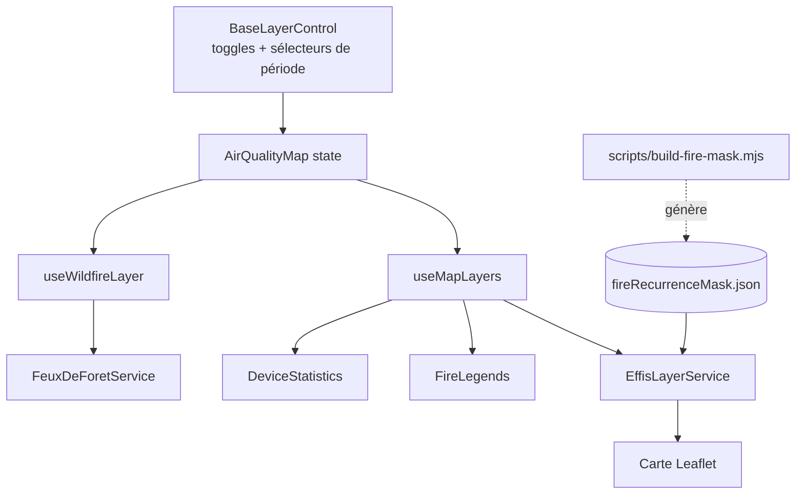

# Couches feux / points de chaleur – OpenAirMap

Documentation technique des overlays carte liés aux incendies (distincts des sources de mesures AQ).

## Vue d’ensemble

| Overlay | Type | Périodes | Activation |
|---------|------|----------|------------|
| EFFIS points de chaleur | WFS GeoJSON (GWIS) | 24 h / 7 j | Toujours proposé (pas de clé) |
| EFFIS zones brûlées | WFS GeoJSON (EFFIS) | Jour / Semaine / Saison | Toujours proposé |
| feuxdeforet.fr | Marqueurs GeoJSON | Filtre client 48 h | Flag `NEXT_PUBLIC_ENABLE_WILDFIRE_LAYER` |

Les trois coexistent dans le menu fonds de carte (`BaseLayerControl`). Ce ne sont **pas** des sources de `DataServiceFactory` / `sources.ts`.



## EFFIS / GWIS (Copernicus)

**Service** : [`src/services/EffisLayerService.ts`](../../src/services/EffisLayerService.ts)

### Points de chaleur

- Base URL : `https://maps.effis.emergency.copernicus.eu/gwis`
- Couche : **`ms:all.hs.query`** (et non `all.hs.week`/`.today`)

  C'est la **même donnée** que les couches temporelles, mais son schéma expose 23 attributs au lieu de 3 : `frp`, `confidence`, `satellite`, `night`, `acq_date`/`acq_time`, `bright_mir`/`bright_tir`, `name_1`/`name_2`. En contrepartie elle n'a pas de découpage temporel intégré — d'où le filtre OGC.

- **Filtre temporel** : `<PropertyIsGreaterThan>` sur `acq_at` en temps réel, `<PropertyIsBetween>` en mode historique.
  - Sur `acq_at` (précision horaire) et non `acq_date` (précision au jour), sinon la fenêtre 24 h serait fausse.
  - Dates formatées **en UTC** : `acq_at` est horodaté en UTC côté EFFIS, un format en heure locale décalerait la fenêtre de 1 à 2 h en France.
  - BBOX en WFS 1.1 / EPSG:4326 : ordre **lat,lon** (l'inverser renvoie zéro résultat, sans erreur).
- **Pas de `MAXFEATURES`** : le plafond de 500 tronquait la couche en pleine saison (867 features mesurés sur l'emprise PACA, 2759 sur l'emprise France) et la coupe était arbitraire. Un seuil de veille (`HOTSPOTS_VOLUME_WARN_THRESHOLD`) journalise seulement les volumes anormaux.
- **Rendu** : `circleMarker` sur un `L.canvas()` partagé (l'emprise France affiche ~1700 points sur 7 j, volume auquel le rendu SVG par défaut devient pénible).
  - Rayon ∝ log₁₀(FRP) — le FRP s'étale de 0,2 à 2764 MW, une échelle linéaire écraserait tout contre le minimum
  - Couleur : rouge < 24 h, orange au-delà
  - Opacité selon `confidence` (High / Nominal / Low)
- **Rafraîchissement** : 10 min en temps réel ; désactivé en mode historique (une date passée ne bouge plus).
- **Rétention : 365 jours glissants** (mesuré : aucune détection avant J-365).

### Débruitage : masque des sources permanentes

Sans filtrage, **la seule zone de Fos-sur-Mer représente un tiers des points affichés sur l'emprise PACA** — ce sont des torchères industrielles, pas des feux de forêt.

Les filtres évidents ne servent à rien : `confidence` vaut *High* pour 98 % des détections de Fos, et `glc` (occupation du sol) vaut 0 pour 87 % des points partout. **Le seul levier efficace est la récurrence spatiale** : un feu de végétation ne brûle pas au même endroit des dizaines de jours répartis sur l'année.

### Ce que le seuil signifie exactement

Pour chaque cellule, le script compte **le nombre de jours calendaires distincts où au moins une détection est tombée**, sur les 365 derniers jours. Au-delà du seuil, la cellule entre dans le masque.

Trois précisions qui évitent les contresens :

- **Ce ne sont pas des jours consécutifs.** Des jours éparpillés sur l'année comptent tout autant.
- **Ce ne sont pas des détections.** Une cellule vue 40 fois dans la même journée compte pour **1 jour**. C'est délibéré : sinon un incendie majeur d'une seule journée, survolé par les 7 satellites, serait masqué.
- **Le masque est binaire et porte sur la cellule, pas sur la détection.** Une fois une cellule classée, **toutes** ses détections disparaissent — y compris un vrai départ de feu dans ce km² — sauf franchissement du garde-fou FRP ci-dessous. C'est le compromis central de ce mécanisme : à retenir avant d'interpréter la carte.

### Génération et calibrage

- **Commande** : `npm run build:fire-mask` → [`scripts/build-fire-mask.mjs`](../../scripts/build-fire-mask.mjs)
  - Emprise France élargie (surensemble des `mapBounds` de toutes les instances) sur 12 mois glissants
  - Cellules de 0,01° (~1,1 km, l'ordre de grandeur de la précision des capteurs)
  - Seuil par défaut : **20 jours distincts** (`--threshold=N` pour l'ajuster)
  - Sortie : [`src/data/fireRecurrenceMask.json`](../../src/data/fireRecurrenceMask.json) (~4 Ko, versionné)
  - Les premières cellules du masque sont Dunkerque (ArcelorMittal), Fos-sur-Mer et Carling/Saint-Avold — la validation est immédiate en revue.

**Pourquoi 20 jours.** La distribution du nombre de jours distincts par cellule (France, 12 mois, 101 751 détections réparties sur 20 462 cellules) est franchement bimodale :

| Jours distincts | Cellules |
|-----------------|----------|
| 1 | 15 218 |
| 2 | 2 982 |
| 3–4 | 1 547 |
| 5–9 | 408 |
| 10–14 | 92 |
| 15–19 | 43 |
| 20–29 | 44 |
| 30–49 | 41 |
| 50–99 | 36 |
| 100+ | 51 |

Jusqu'à 9 jours, la population décroît exponentiellement — signature de feux ponctuels. À partir de 15, la décroissance **s'arrête** et laisse place à un plateau (43, 44, 41, 36, 51) qui ne s'éteint pas : c'est une autre population, celle des sources toujours actives.

Calibrage sur cette même fenêtre de 12 mois (donc directement comparable au fichier livré) :

| Seuil | Cellules | Points retirés |
|-------|----------|----------------|
| 5 j | 715 | 39,9 % |
| 10 j | 307 | 34,8 % |
| 15 j | 215 | 33,4 % |
| **20 j** | **172** | **32,5 %** |
| 30 j | 128 | 31,0 % |
| 50 j | 87 | 28,8 % |

Le seuil est arbitré sur le **risque par cellule**, pas sur le taux de filtrage : passer de 10 à 20 jours ne coûte que 2,3 points de débruitage mais retire 135 cellules de la surface de risque — 135 km² où un feu réel aurait pu être masqué sans contrepartie. Les cellules lourdes (≥ 30 jours) font l'essentiel du travail à elles seules.
- **Garde-fou FRP** : au-delà de `frpOverrideMw` (50 MW), le point est affiché **malgré** le masque. Sur 12 mois, le FRP des points masqués plafonne à 134 MW (p99 = 17 MW) contre 2764 MW pour les points conservés : un incendie réel déclaré sur un site industriel reste visible.
- **Clé de cellule partagée** : [`src/utils/fireCellKey.mjs`](../../src/utils/fireCellKey.mjs), importée **à la fois** par le script Node et par le service TypeScript. Volontairement en `.mjs` — toute divergence entre les deux rendrait le masque inopérant sans lever d'erreur.

  ⚠️ L'arrondi à 1e-9 avant troncature n'est pas cosmétique : `2.28 / 0.01` vaut `227.99999999999997`, et un `Math.floor` direct range un point tombant sur une frontière dans la cellule précédente.
- **Régénération** : à la demande. Les sites industriels bougent peu ; le script journalise le nombre de cellules et le pourcentage retiré, à comparer en revue avec la génération précédente.
- **Application** : le masque agit **partout**, temps réel comme mode historique, pour la cohérence. Le masquage est silencieux, mentionné en légende.

### Zones brûlées

- Base URL : `https://maps.effis.emergency.copernicus.eu/effis`
- Couches : `ms:modis.ba.poly.today` / `.week` / `.season`, et **`.2016` à `.2025`** en archive annuelle
- Volumes mesurés en PACA : 0 / 8 / 144 — d'où le défaut sur `season` et l'état vide explicite sur `today` (MODIS met plusieurs jours à cartographier un périmètre)
- Popup riche : dates, surface, commune, occupation du sol, Natura 2000
- MODIS retenu plutôt que le NRT (`nrt.ba.poly.*`) : le NRT est plus frais mais ne capte que les grands feux (127 ha minimum), n'expose que 5 attributs et **n'a pas d'archives annuelles**, donc serait inutilisable en mode historique.

## Mode historique

Les couches feux suivent la timeline de `useTemporalVisualization` via `historicalPlaybackDate`.

- **Fenêtre glissante de 24 h** fermée sur la date rejouée. Les satellites ne survolent que 4 à 6 fois par jour : un instantané strict laisserait la quasi-totalité des pas (15 min, heure) vides.
- **Cache journalier** ([`hotspotsDayCache`](../../src/services/EffisLayerService.ts)) : une entrée par jour rejoué, couvrant `[début du jour − 24 h, fin du jour]`, soit le sur-ensemble de toutes les fenêtres de 24 h se terminant dans la journée. La découpe fine se fait ensuite côté client.

  Sans lui, parcourir une semaine au pas horaire déclencherait 168 requêtes pour 7 journées de données. Le cache ne sert **que** le mode historique — le temps réel doit rester frais. Un échec n'est pas mis en cache, la journée peut être retentée.
- **Zones brûlées** : bascule automatique sur `modis.ba.poly.<année>` pour une année révolue, puis filtre sur `FIREDATE` pour ne pas montrer de feux postérieurs à la date rejouée.
- **Limite de rétention** : au-delà de 365 jours, la couche points de chaleur est désactivée et un message l'explique (`panels.effisHotspotsBeyondRetention`) plutôt que d'afficher un vide trompeur. Les zones brûlées, elles, remontent à 2016 : **l'asymétrie est assumée**.

## Emprise géographique

Les deux couches EFFIS utilisent `DOMAIN_CONFIG[instance].mapBounds` ([`src/config/domainConfig.ts`](../../src/config/domainConfig.ts)) comme BBOX, sans refetch au déplacement de la carte.

Volumes mesurés en août 2026, masque à 20 jours :

| Emprise | Période | Brut | Affiché | Masqué |
|---------|---------|------|---------|--------|
| PACA (atmosud) | 24 h | 43 | 6 | 37 (86 %) |
| PACA (atmosud) | 7 j | 846 | 554 | 292 (35 %) |
| France (default) | 24 h | 371 | 170 | 201 (54 %) |
| France (default) | 7 j | 2800 | 1770 | 1030 (37 %) |

⚠️ **La vue 24 h est structurellement clairsemée** : sur une journée calme, les sources permanentes dominent en proportion et il ne reste qu'une poignée de points (6 en PACA sur cette mesure). Ce n'est pas une panne, et relever le seuil n'y changerait rien — ces détections viennent des cellules les plus lourdes (Fos dépasse 100 jours). D'où l'état vide explicite côté UI.

## UI et légendes

| Élément | Fichier |
|---------|---------|
| Toggles + sélecteurs de période | [`BaseLayerControl.tsx`](../../src/components/controls/BaseLayerControl.tsx) |
| Add/remove overlays, stats, erreurs | [`useMapLayers.ts`](../../src/components/map/hooks/useMapLayers.ts) |
| État + date de référence historique | [`AirQualityMap.tsx`](../../src/components/map/AirQualityMap.tsx) |
| Légendes vectorielles | [`FireLegends.tsx`](../../src/components/map/FireLegends.tsx) |
| Conteneur légendes | [`OverlayLegendsPanel.tsx`](../../src/components/map/OverlayLegendsPanel.tsx) |
| Colonne droite (légendes + stats) | [`MapOverlays.tsx`](../../src/components/map/MapOverlays.tsx) |

Comportement :

- **Légendes rendues localement**, plus par `GetLegendGraphic` : depuis que le rayon dépend du FRP, l'image servie par EFFIS ne décrit plus ce que la carte affiche. Les rayons de la légende sont calculés par `getHotspotRadius()`, la même fonction que les marqueurs — la légende ne peut pas dériver du rendu.
- **Pas de repli WMS** : le WFS est le seul chemin. Le type d'union `L.GeoJSON | L.TileLayer.WMS` a disparu du hook.
- Statistiques dans `DeviceStatistics` : nombre de points affichés, période, FRP max ; nombre de zones brûlées et surface cumulée.
- États vides explicites sur les deux couches, plus un message dédié au dépassement de rétention.
- Une seule légende ouverte à la fois, zone scrollable. Desktop : au-dessus de `DeviceStatistics`. Mobile : bouton flottant + popover.

Clés i18n : `baseLayer.effis*`, `baseLayer.firePeriod*`, `baseLayer.fireLegend*`, `panels.effis*`, `statistics.effis*` — présentes dans les **6 locales** (`fr`, `en`, `de`, `es`, `it`, `ar` ; l'arabe utilise ses six formes plurielles).

## Tests

[`src/services/__tests__/EffisLayerService.test.ts`](../../src/services/__tests__/EffisLayerService.test.ts) — 30 tests couvrant :

- format UTC et construction des filtres OGC (bornes, ordre lat/lon, champ `acq_at`)
- résolution des couches de zones brûlées (relatives vs archives annuelles)
- échelle des rayons et bornes sur toute la plage de FRP observée
- masque : cellules, garde-fou FRP, coordonnées invalides, **cohérence entre la clé du script et celle du runtime**
- mode historique : fenêtre de 24 h, cache journalier (1 requête pour 4 instants du même jour), absence de cache en temps réel, non-empoisonnement après échec

## feuxdeforet.fr

- **Service** : [`src/services/FeuxDeForetService.ts`](../../src/services/FeuxDeForetService.ts)
- **Hook** : [`src/components/map/hooks/useWildfireLayer.ts`](../../src/components/map/hooks/useWildfireLayer.ts)
- **Proxy** : `/feuxdeforet` (rewrite Next + reverse proxy prod) — l’API bloque le CORS navigateur
- **Filtre** : signalements non clos, fenêtre de fraîcheur 48 h
- **Flag** : `featureFlags.wildfireLayer` ← `NEXT_PUBLIC_ENABLE_WILDFIRE_LAYER`

## Fichiers clés (checklist)

```
src/services/EffisLayerService.ts
src/services/__tests__/EffisLayerService.test.ts
src/utils/fireCellKey.mjs                 # clé de cellule partagée script/runtime
src/utils/fireCellKey.d.mts
src/data/fireRecurrenceMask.json          # généré, versionné
scripts/build-fire-mask.mjs               # npm run build:fire-mask
src/components/map/FireLegends.tsx
src/services/FeuxDeForetService.ts
src/config/domainConfig.ts                # mapBounds
src/config/featureFlags.ts                # wildfireLayer uniquement
src/components/map/hooks/useMapLayers.ts
src/components/map/hooks/useWildfireLayer.ts
src/components/controls/BaseLayerControl.tsx
src/components/map/OverlayLegendsPanel.tsx
src/components/map/MapOverlays.tsx
src/locales/{fr,en,de,es,it,ar}.json
.env.inc                                  # NEXT_PUBLIC_ENABLE_WILDFIRE_LAYER
```
