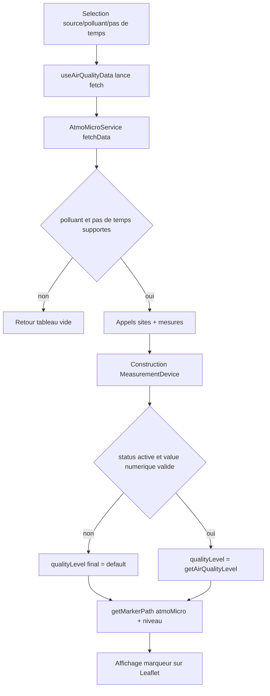

# Flow AtmoMicro - affichage des marqueurs

## Objectif
Ce document explique le flow complet des microcapteurs qualifies AtmoMicro, depuis la requete initiale jusqu'au rendu sur la carte, avec un focus sur les conditions d'affichage:
- marqueur par defaut (`default`)
- marqueur colore selon seuil (`bon`, `moyen`, `degrade`, `mauvais`, `tresMauvais`, `extrMauvais`)

## Vue d'ensemble du flow
1. L'utilisateur selectionne un polluant, un pas de temps et des sources dans l'UI.
2. `useAirQualityData` orchestre le chargement des sources actives.
3. `DataServiceFactory` instancie/reutilise `AtmoMicroService`.
4. `AtmoMicroService.fetchData()` appelle l'API AtmoMicro, transforme les donnees en `MeasurementDevice`.
5. `AirQualityMap` recoit la liste `devices` et rend les marqueurs.
6. `createCustomIcon()` choisit l'icone finale (default ou par seuil) et le texte affiche.

## Etape 1 - Declenchement du chargement
Fichier cle: `src/hooks/useAirQualityData.ts`

- Le hook est appele avec:
  - `selectedPollutant`
  - `selectedTimeStep`
  - `selectedSources`
- Les sources "communautaires" sont mappees vers leur code service reel (`communautaire.x` -> `x`).
- Si `atmoMicro` est present dans les sources mappees, le service AtmoMicro est charge.
- Le hook appelle ensuite `service.fetchData(...)` pour chaque source.

Point de debug:
- Si `atmoMicro` n'est pas dans `mappedSources`, aucun marqueur AtmoMicro ne peut apparaitre.

## Etape 2 - Resolution du service
Fichier cle: `src/services/DataServiceFactory.ts`

- `DataServiceFactory.getService('atmoMicro')` retourne une instance singleton de `AtmoMicroService`.
- Le registre `serviceConstructors` mappe explicitement `atmoMicro` -> `AtmoMicroService`.

Point de debug:
- Si le code source envoye n'est pas exactement `atmoMicro`, la factory ne trouvera pas le service.

## Etape 3 - Validation polluant/pas de temps AtmoMicro
Fichier cle: `src/services/AtmoMicroService.ts`

Dans `fetchData(params)`:

1. Mapping polluant interne via `getAtmoMicroVariable(params.pollutant)`.
   - Supporte: `pm25`, `pm10`, `pm1`, `no2`, `o3`, `so2`.
   - Sinon: warning + retour `[]`.
2. Mapping pas de temps via `getAtmoMicroTimeStepConfig(params.timeStep)`.
   - Supporte: `instantane`, `deuxMin`, `quartHeure`, `heure`.
   - `jour` non supporte.
   - Si non supporte: warning + retour `[]`.

Impact affichage:
- Si un de ces 2 mappings echoue, aucun device AtmoMicro n'est produit, donc aucun marqueur AtmoMicro.

## Etape 4 - Requetes API AtmoMicro
Fichier cle: `src/services/AtmoMicroService.ts`

Deux appels en parallele:
- `fetchSites(variable)`:
  - utilise un cache statique de sites (`getCachedAllSites()`)
  - filtre les sites selon la variable mesuree
- `fetchMeasures(variable, aggregation, delais)`:
  - appelle `/mesures/dernieres` avec l'agregation et le delai derives du pas de temps

Si une reponse est absente/invalide:
- warning "Aucune donnee recue d'AtmoMicro"
- retour `[]`

## Etape 5 - Construction des `MeasurementDevice`
Fichier cle: `src/services/AtmoMicroService.ts`

Le service construit 2 categories:

### 5.1 Sites avec mesure recente -> `status: "active"`
Pour chaque mesure:
- recupere le site associe
- calcule `displayValue`
  - si `quart-horaire`: `valeur_ref ?? valeur_brute ?? valeur ?? 0`
  - sinon: `valeur ?? valeur_brute`
- calcule `qualityLevel` avec `getAirQualityLevel(displayValue, thresholdsPolluant)`
- cree un `MeasurementDevice` avec:
  - `status: "active"`
  - `value: displayValue`
  - `qualityLevel`: niveau calcule
  - infos correction (`has_correction`, `corrected_value`, `raw_value`)

### 5.2 Sites sans mesure recente -> `status: "inactive"`
Pour chaque site sans mesure:
- cree un `MeasurementDevice` avec:
  - `status: "inactive"`
  - `value: 0`
  - `qualityLevel: "default"`

Impact affichage:
- Les capteurs sans mesure recente sont explicitement forces vers un rendu "par defaut".

## Etape 6 - Calcul du niveau de qualite (seuil)
Fichiers cles:
- `src/utils/index.ts`
- `src/constants/pollutants.ts`

`getAirQualityLevel(value, thresholds)`:
- retourne `default` si valeur invalide (`null`, `undefined`, `NaN`, non-number)
- sinon compare aux seuils du polluant:
  - `bon`
  - `moyen`
  - `degrade`
  - `mauvais`
  - `tresMauvais`
  - `extrMauvais`

Impact affichage:
- Le niveau de qualite ne depend pas de la source graphique, mais des seuils du polluant actif.

## Etape 7 - Passage des devices vers la carte
Fichier cle: `src/components/map/AirQualityMap.tsx`

- `App.tsx` passe `devices` au composant `AirQualityMap`.
- `AirQualityMap` trie les devices par priorite (`sortDevicesByPriority`).
- Seuls les devices `mobileair` sont filtres du rendu standard (geres a part).
- Les devices AtmoMicro restent dans la liste rendue.
- Rendu via:
  - `CustomSpiderfiedMarkers` (mode spiderfy actif)
  - ou `MarkerWithTooltip` (sinon)
- Dans les 2 cas, l'icone provient de `createCustomIcon(device, ...)`.

## Etape 8 - Regle finale de choix de marqueur (point central)
Fichier cle: `src/components/map/utils/mapIconUtils.ts`

Dans `createCustomIcon`:

1. Calcul `hasValidValue`:
   - `device.status === "active"`
   - `device.value !== null`
   - `device.value !== undefined`
   - `!isNaN(device.value)`
   - `typeof device.value === "number"`
2. Si `hasValidValue` est faux -> `qualityLevel = "default"`
3. Sinon:
   - `qualityLevel = device.qualityLevel` (si present)
   - sinon fallback `default`
4. `getMarkerPath(device.source, qualityLevel)` construit le chemin image.

Pour AtmoMicro (`source = atmoMicro`), la base est:
- `/markers/atmoMicroMarkers/microStationAtmoSud_<qualityLevel>.png`
- exemple: `_default`, `_bon`, `_mauvais`, etc.

## Conditions exactes d'affichage des 2 types de marqueurs

### A. Marqueur par defaut (`default`)
Un capteur AtmoMicro est rendu en `default` si au moins une de ces conditions est vraie:
- `status !== "active"` (cas typique: site sans mesure recente -> `inactive`)
- `value` est `null`
- `value` est `undefined`
- `value` est `NaN`
- `value` n'est pas de type `number`
- `qualityLevel` absent alors que `hasValidValue` est faux (fallback `default`)

Cas frequent:
- Les sites sans mesure recente sont construits en `inactive` + `qualityLevel: default` dans le service.

### B. Marqueur par seuil (colore)
Un capteur AtmoMicro est rendu avec un niveau `bon` a `extrMauvais` si:
- `status === "active"`
- `value` est numerique valide
- `qualityLevel` a ete calcule par `getAirQualityLevel(...)` a la transformation service

Le niveau exact depend:
- du polluant selectionne
- de ses seuils dans `constants/pollutants.ts`
- de la valeur retenue (`displayValue`) selon l'agregation

## Particularites AtmoMicro a connaitre

- En `quartHeure`, la valeur affichee privilegie `valeur_ref` (puis fallback).
- L'indicateur visuel de correction (petit badge bleu) est affiche si:
  - `device.source === "atmoMicro"`
  - `device.has_correction === true`
- Les valeurs negatives sont forcees a `0` pour l'affichage texte dans l'icone.
- Le tri de priorite met AtmoMicro derriere AtmoRef et devant NebuleAir.

## Symptomes probables -> causes de code

- "Je vois des marqueurs AtmoMicro gris/default alors que la source est active"
  - Cause probable: devices `inactive` (pas de mesure recente) ou valeur invalide.
- "Je ne vois aucun marqueur AtmoMicro"
  - Cause probable: polluant/pas de temps non supporte par AtmoMicro, ou source non selectionnee/mal mappee.
- "Le niveau de couleur ne correspond pas a ce que j'attends"
  - Cause probable: seuils du polluant courant differents de l'hypothese metier, ou `displayValue` issue de `valeur_ref` en quart-horaire.
- "Le chiffre affiche ne correspond pas a la couleur attendue"
  - Cause probable: confusion entre valeur brute, corrigee et valeur affichee (`displayValue`) selon l'agregation.

## Checklist de debug rapide

1. Verifier la source:
   - `selectedSources` contient `atmoMicro` (ou mapping correct via `communautaire.*` si applicable).
2. Verifier compatibilite:
   - polluant supporte par `getAtmoMicroVariable`.
   - pas de temps supporte par `getAtmoMicroTimeStepConfig`.
3. Verifier payload mesures:
   - presence de `valeur`, `valeur_brute`, `valeur_ref`, `time`, `lat`, `lon`.
4. Verifier transformation service:
   - `status` (`active` vs `inactive`)
   - `value` final (`displayValue`)
   - `qualityLevel` calcule
5. Verifier choix icone:
   - `hasValidValue` dans `createCustomIcon`
   - `qualityLevel` final utilise pour `getMarkerPath`
6. Verifier asset image:
   - fichier attendu present dans `public/markers/atmoMicroMarkers/`.
7. Verifier rendu carte:
   - device non filtre (seul `mobileair` est filtre ici)
   - marqueur present dans `CustomSpiderfiedMarkers` / `MarkerWithTooltip`.

## Schema de decision (resumé)

